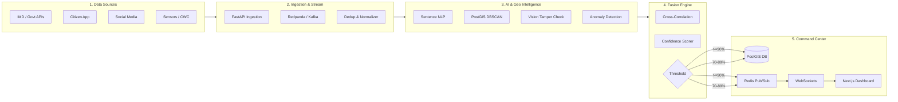

<div align="center">

# 🌩️ INDRA
### **Intelligent National Disaster & Weather Platform**
*From fragmented weather reports to verified, actionable weather events.*

[](https://sih.gov.in/)
[](https://sih.gov.in/)
[](https://sih.gov.in/)
[](#team-sixth-sense)
[](LICENSE)

---

**FastAPI** • **PostgreSQL + PostGIS** • **Redpanda / Kafka** • **Redis** • **PyTorch / NLP** • **Next.js / React**

</div>

---

## 📌 Problem Statement Overview

- **Problem Statement ID**: `SIH26069`
- **Problem Statement Title**: National Weather Big Data Analytics Platform
- **Theme**: Disaster Management
- **Category**: Software
- **Team Name**: Sixth Sense

---

## 📖 Executive Summary

During severe weather crises—such as flash floods, cloudbursts, and cyclones—emergency dispatchers and disaster response agencies face **extreme signal fragmentation and alert fatigue**. Reports pour in across disjointed channels: citizen mobile apps, Twitter/X posts (`#IMD`, `#PatnaRains`), regional news websites, and asynchronous sensor telemetry from the India Meteorological Department (IMD) and Central Water Commission (CWC). 

**INDRA** (*Intelligent National Disaster & Weather Platform*) is an AI-powered, real-time geospatial intelligence engine that ingests, deduplicates, and cross-verifies multi-source data streams. An event is confirmed only when independent sources agree, filtering out false rumors and condensing hundreds of chaotic alerts into a single, high-confidence, actionable incident.

```
       127 SCATTERED SIGNALS                            1 VERIFIED EVENT
┌──────────────────────────────────┐          ┌───────────────────────────────────┐
│ • 64 Citizen app reports         │          │ PATNA URBAN FLOOD EVENT           │
│ • 48 Social media #IMD posts     │  ═════>  │ • Severity: CRITICAL              │
│ • 3 IMD Automatic Weather Stns   │  INDRA   │ • Confidence: 94% [AUTO-PUBLISHED]│
│ • 2 CWC River Level Gauges       │          │ • Boundary: Rajendra Nagar-Digha  │
│ • 10 Verified media photos       │          │ • Action: Dispatched to BSDMA/NDRF│
└──────────────────────────────────┘          └───────────────────────────────────┘
```

---

## 🏛️ The Three-Pillar Core Concept

| 1. COLLECT | 2. UNDERSTAND | 3. VERIFY |
| :--- | :--- | :--- |
| **Pulls fragmented reports into one common stream** | **Transforms unstructured text, images, and numbers into structured events** | **Confirms an event only when independent sources corroborate** |
| • Govt & weather APIs (IMD AWS) <br>• Social media & `#IMD` posts <br>• Citizen app reports <br>• Public river gauges (CWC) <br>• Crowdsourced photos/videos <br>• Local news and weather feeds | • Weather-event classification <br>• NLP semantic report embeddings <br>• Computer Vision image checks <br>• Sensor anomaly detection (Isolation Forest) <br>• Near-duplicate detection <br>• PostGIS spatial DBSCAN clustering | • Source reliability scoring <br>• $\ge 2$ independent source consensus <br>• Official weather station agreement <br>• Spatio-temporal proximity (GPS + Time) <br>• Evidence audit trail <br>• Explainable confidence score ($0-100\%$) |

---

## 🏗️ Five-Stage System Architecture



### Real-Time Flow
$$\text{Sources} \longrightarrow \text{Redpanda/Kafka} \longrightarrow \text{AI Workers} \longrightarrow \text{Fusion Engine} \longrightarrow \text{PostgreSQL/PostGIS} \longrightarrow \text{WebSocket} \longrightarrow \text{Live Command Dashboard}$$

### Verification Thresholds & Gating

- **$\ge 90\%$ (Auto-Published)**: Unambiguous disaster confirmation across independent sensors and multi-citizen corroboration. Immediately dispatched to NDRF, SDMAs, and District Magistrates.
- **$70\% - 89\%$ (Human Review)**: High-likelihood occurrence requiring human-in-the-loop sign-off by a disaster management officer before broadcasting mass public alerts.
- **$< 70\%$ (Held Back / Monitoring)**: Sub-threshold noise, isolated claims, or uncorroborated single-source social media rumors held in working memory.

---

## 💡 Grounded Technical Choices

| Architectural Choice | Alternative Considered | Technical Rationale |
| :--- | :--- | :--- |
| **PostGIS (Spatial Polygons)** | Standard Lat/Lng Columns | Flood zones, cyclone winds, and cloudburst inundations are **geometric polygons**, not 0-dimensional points. PostGIS enables high-performance spatial joins (`ST_Intersects`, `ST_Within`), dynamic hazard buffers, and polygon clustering. |
| **Redpanda / Kafka** | Direct Database Writes | Disaster events trigger sudden **50x spikes** in incoming traffic. Direct DB writes exhaust connection pools and crash the API. A streaming queue absorbs traffic bursts and protects stateful stores. |
| **Sentence Embeddings (NLP)** | Exact Keyword Matching | Citizens use varied terminology (*"water up to waist on bypass"* vs *"heavy waterlogging near bypass"*). Dense sentence vectors capture contextual semantics regardless of phrasing. |
| **DBSCAN Clustering** | K-Means Clustering | K-Means requires specifying cluster count $K$ in advance, which is impossible in an unfolding disaster. DBSCAN discovers arbitrary cluster shapes and labels outliers as noise. |

---

## 🗺️ MVP Roadmap

```
  LEVEL 1: CORE MVP
  Citizen Reports ➔ FastAPI ➔ PostgreSQL/PostGIS ➔ Basic Classification ➔ Live Map
         │
         ▼
  LEVEL 2: STRONG PROTOTYPE (SIH TARGET) ★
  + Govt / IMD APIs + Redpanda Streaming + NLP Deduplication + Explainable Verification Engine + WebSocket Updates
         │
         ▼
  LEVEL 3: FUTURE SCALE
  + Multi-Spectral Satellite Data + Advanced Distributed ML + National-Scale Multi-Region High Availability
```

---

## 📁 Repository Structure

```
INDRA/
├── docker-compose.yml              # PostgreSQL + PostGIS, Redis, Redpanda stack
├── .env.example                    # Environment variable configuration template
├── LICENSE                         # MIT License
├── README.md                       # Project documentation & overview
├── docs/
│   └── ARCHITECTURE.md             # Detailed engineering & mathematical specification
├── backend/
│   ├── app/
│   │   ├── api/                    # REST routes (reports, events, ingestion, analytics)
│   │   ├── core/                   # Configuration, security, database connectors
│   │   ├── models/                 # SQLAlchemy & PostGIS schemas, Pydantic DTOs
│   │   ├── services/               # Fusion engine, NLP deduplication, geospatial clustering
│   │   └── workers/                # Kafka consumer workers & background tasks
│   └── requirements.txt            # Python dependencies
├── frontend/
│   ├── package.json                # Next.js / React dependencies
│   ├── public/                     # Static assets & icons
│   └── src/
│       ├── app/                    # Next.js App Router pages
│       └── components/             # Command center UI, Leaflet/MapLibre maps, alert feeds
├── data/
│   └── samples/
│       └── patna_flood_scenario.json  # 127-report Patna flood verification dataset
└── scripts/
    └── run_patna_demo.py           # End-to-end demonstration simulation runner
```

---

## 🚀 Quick Start & Local Setup

### Prerequisites
- **Python 3.11+** (Tested on Python 3.14)
- **Node.js 18+** & **npm**
- **Docker & Docker Compose**

### 1. Clone & Setup Environment
```bash
git clone https://github.com/SabaSaiid/INDRA.git
cd INDRA
cp .env.example .env
```

### 2. Start Core Infrastructure (PostGIS, Redis, Redpanda)
```bash
docker compose up -d
```
Verify all services are healthy:
```bash
docker compose ps
```

### 3. Setup and Launch Backend
```bash
cd backend
python3 -m venv .venv
source .venv/bin/activate
pip install -r requirements.txt
uvicorn app.main:app --reload --port 8000
```
Backend Swagger API Documentation will be available at: `http://localhost:8000/docs`

### 4. Setup and Launch Command Center Frontend
```bash
cd ../frontend
npm install
npm run dev
```
Open `http://localhost:3000` to access the **INDRA Live Command Center**.

### 5. Run the 127-Report Patna Flood Simulation
To test the fusion engine with the benchmark Patna inundation scenario:
```bash
python3 scripts/run_patna_demo.py
```
Watch the 127 scattered signals ingest through Redpanda, cluster via PostGIS DBSCAN, and auto-publish a single **CRITICAL** verified event with a **94% confidence score**.

---

## 👥 Team Sixth Sense

Developed with pride for **Smart India Hackathon 2026** under Problem Statement **SIH26069** (*National Weather Big Data Analytics Platform*).

* **Organization**: Ministry of Earth Sciences / Disaster Management Authorities
* **Repository**: [INDRA on GitHub](https://github.com/SabaSaiid/INDRA)
* **License**: [MIT License](LICENSE)
