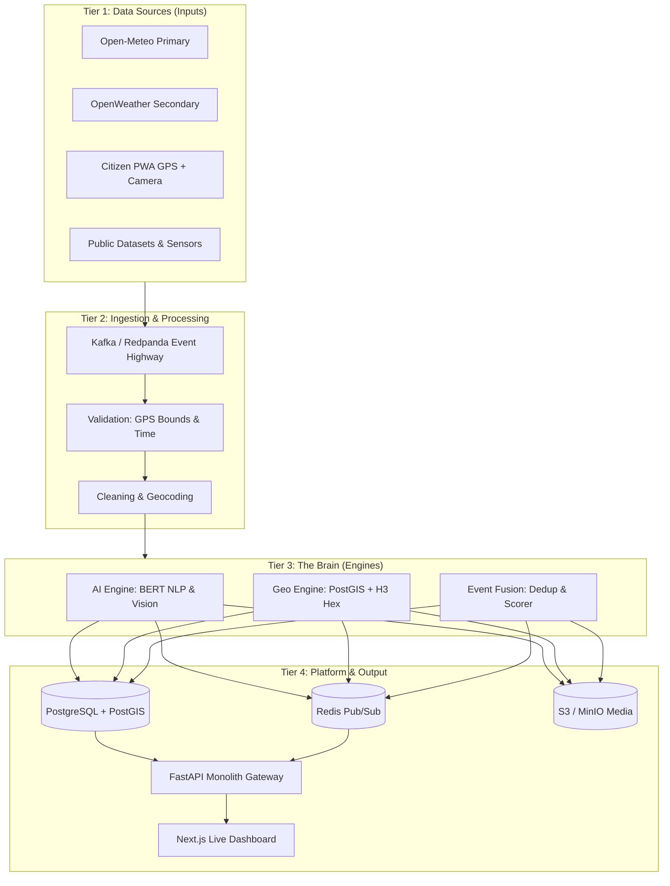
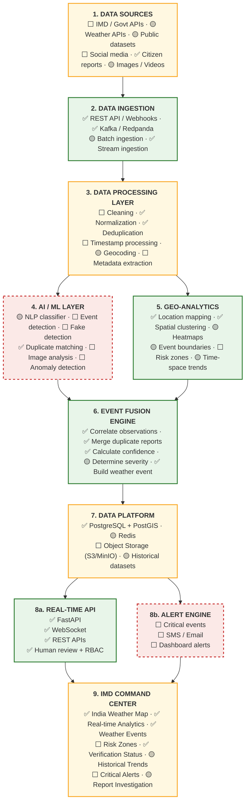

<div align="center">

# 🌩️ INDRA
### **Intelligent National Disaster & Weather Platform**
*From fragmented weather reports to verified, actionable weather events.*

[](https://sih.gov.in/)
[](https://sih.gov.in/)
[](https://sih.gov.in/)
[](#team-sixth-sense)
[](LICENSE)

---

**FastAPI** • **PostgreSQL + PostGIS** • **Uber H3** • **Redpanda / Kafka** • **Redis** • **Sentence-Transformers** • **Next.js**

</div>

---

## 📌 Problem Statement Overview

- **Problem Statement ID**: `SIH26069`
- **Problem Statement Title**: National Weather Big Data Analytics Platform
- **Theme**: Disaster Management
- **Category**: Software
- **Team Name**: Sixth Sense

---

## 💡 Core Philosophy: Intelligence Platform vs Weather App

> **"We are building an intelligence platform, not a weather app."**

Standard weather apps answer: *"What is the weather in Patna?"* (1 API request $\rightarrow$ 1 UI update).  
**INDRA** answers: **"What weather events are happening, how severe are they, how reliable is the data, and what is the underlying verifiable evidence?"**

```
Standard Weather App:
[1 API Request] ────────────────────────► [1 UI Update] (Basic CRUD)

INDRA Platform:
[Citizen report A] ┐
[Citizen report B] ┼──► [Geo / Fusion Layer] ──► [1 Verified Weather Event]
[Citizen report C] ┘    • PostGIS + Uber H3 Hex    • Event ID:   INDRA-YYYYMMDD-NNN
                        • DBSCAN clustering        • Confidence: total_weighted / factor_coverage
                        • MiniLM dedup             • Coverage:   0.80 (vision, anomaly offline)
                        • Open-Meteo rainfall      • Status:     set by the published gates
                        • Rule-based severity      • Evidence:   every report, in provenance
```

The right-hand column is the shape of every event, not one event's numbers. **Deep learning and anomaly
detection are deliberately absent**: the only model in the data path is MiniLM sentence embeddings for
deduplication. The AI/ML layer left this project's scope on 20 Sep, and the receipt marks its two
factors `offline` on every event rather than substituting a number.

---

## 📖 Executive Summary & Case Study

During acute crises (cloudbursts, flash floods, cyclones), emergency dispatchers face severe **alert
fatigue and report fragmentation**. INDRA consolidates scattered reports into **one verified event**
carrying an explainable evidence receipt.

The box below is a **worked example, not a real event**: the engine's output on 20 Sep 2026 for
five **scripted test reports** posted to `POST /api/reports/submit`. They described no real flood,
and the script, the reports and the event have since been deleted. Only the arithmetic is kept,
because it shows how a score is built.

```
   5 SCRIPTED TEST REPORTS                          1 TEST EVENT
┌──────────────────────────────────┐      ┌────────────────────────────────────────┐
│ • 5 test reports (CITIZEN_APP)   │      │ test event  (URBAN_FLOOD)              │
│ • 1 quoting "knee deep water"    │ ═══> │ • Severity:   MODERATE                 │
│ • live Open-Meteo rainfall       │INDRA │ • Confidence: 0.4984                   │
│   (0.008 — Patna was dry)        │      │ • Coverage:   0.80                     │
│                                  │      │ • Status:     QUARANTINED              │
│                                  │      │ • Footprint:  39-vertex polygon        │
└──────────────────────────────────┘      └────────────────────────────────────────┘

   confidence = total_weighted / factor_coverage = 0.3987 / 0.80 = 0.4984
```

**`QUARANTINED` is the correct verdict here, not a failure.** Five unverified reports and
near-zero rainfall is not a verified disaster, and the receipt shows exactly which evidence produced
that number. The score rises with independent corroboration and with real rainfall.

**`factor_coverage` is the honesty.** It is the share of the designed model that actually reported.
`0.80` means two factors — `vision_analysis` (0.15) and `anomaly_detection` (0.05) — did not report at
all, so the score is a mean over the 80% that did. Those two are **permanently offline**: the AI/ML
layer left this project's scope on 20 Sep, and the receipt says so on every event rather than
substituting a plausible number. **The score is never quoted without its coverage.**

> **What was here before, and why it is gone.** This section previously showed "127 SCATTERED SIGNALS"
> resolving to event `WX-EV-28231827-A` at "Confidence: 94% [AUTO-PUBLISHED]", built from "48 Social
> media #IMD posts", "2 CWC River Level Gauges" and "10 Verified media photos". None of that existed.
> On 21 Sep there was no IMD, CWC or social-media feed in this system — Open-Meteo was the only
> external source, decided 16 Sep for want of API keys — image verification is offline, and the
> **94% never came from the scoring engine**. It was replaced on 21 Sep with the worked example
> above. Official IMD, CWC and SDMA warnings (through NDMA's SACHET feed), airport METARs, Mastodon
> posts and Google News headlines have been added since, and on 25 Sep the scripted reports, the
> seed script and the demo mode were deleted.

---

## ⚖️ Decoupling Confidence from Severity: The 2×2 Matrix

Disaster response demands separating **how dangerous an event is** (Severity) from **how certain we are that it is happening** (Confidence):

| | Low Confidence | High Confidence |
| :--- | :--- | :--- |
| **High Severity (Critical)** | **UNVERIFIED THREAT**<br>*(e.g., 1 report of a dam break)*<br>👉 **Flag for Immediate Human Review** | **CRITICAL VERIFIED EVENT**<br>*(e.g., Patna flood with 100+ reports)*<br>🚨 **Trigger Immediate Public & NDRF Alert** |
| **Low Severity (Advisory)** | **NOISE**<br>*(e.g., Uncorroborated rumor or tweet)*<br>🧹 **Filter & Ignore** | **CONFIRMED MINOR EVENT**<br>*(e.g., Verified localized puddle)*<br>ℹ️ **Monitor; no alert dispatch** |

---

## 🏛️ The Three-Pillar Core Engine

| 1. COLLECT | 2. UNDERSTAND | 3. VERIFY |
| :--- | :--- | :--- |
| **Pulls fragmented reports into one stream** | **Extracts multi-modal intelligence, not just keywords** | **Confirms an event only when independent sources agree** |
| • Open-Meteo (Primary API) <br>• OpenWeather (Secondary API) <br>• Citizen Mobile PWA (GPS + Camera) <br>• Social media & `#IMD` posts <br>• CWC River Gauges & IMD AWS | • BERT / Sentence Transformers NLP <br>• Coordinate validation & Geocoding <br>• PostGIS `ST_ClusterDBSCAN` <br>• Uber H3 Hexagonal Spatial Indexing <br>• PyTorch/OpenCV image flood checks <br>• Isolation Forest anomaly detector | • **The Verification Receipt (100 pts)** <br>• $\ge 2$ independent source consensus <br>• Weather station agreement <br>• Spatio-temporal proximity (GPS + Time) <br>• Unalterable SHA-256 audit trail <br>• Human-in-the-loop review queue |

> **Built vs. designed in the table above.** **COLLECT:** the Citizen Mobile PWA endpoint is
> live, Open-Meteo rainfall is polled every 10 minutes, and official IMD, CWC and SDMA **warnings**
> are read from NDMA's SACHET CAP feed every 5 minutes; no IMD or CWC sensor data, OpenWeather or
> social feed is read. **UNDERSTAND:** coordinate validation (out-of-India → 422), district
> geocoding, DBSCAN clustering (great-circle radius) and H3 indexing are real; Sentence-Transformers runs **for
> duplicate matching only**, and the PyTorch/OpenCV and Isolation Forest components are not
> implemented. **VERIFY:** the Verification Receipt, multi-source consensus, weather agreement
> and spatio-temporal proximity are real; the **SHA-256 audit trail is a working hash chain**
> and the **human review queue has an auth-gated endpoint** (both Day 3). See the
> Implementation Status ledger below.

---

## 🧾 The Verification Receipt

INDRA does not output an opaque score; it calculates an **explainable, unalterable audit receipt**:

$$\text{Confidence} = 25\% (\text{Weather}) + 20\% (\text{Reports}) + 20\% (\text{Spatio-Temporal}) + 15\% (\text{Vision}) + 15\% (\text{Reliability}) + 5\% (\text{Anomaly})$$

```
┌────────────────────────────────────────────────────────────────────────┐
│                        THE VERIFICATION RECEIPT                        │
├────────────────────────────────────────────────────────────────────────┤
│  Weather Station Corroboration (25%): 24 h rainfall vs IMD categories  │
│  Report Density Analysis       (20%): independent reporters            │
│  Spatial Coherence Score       (20%): cluster diameter vs 10 km search │
│  Computer Vision Analysis      (15%): offline — out of scope           │
│  Source Reliability Index      (15%): best source prior in cluster     │
│  Anomaly Detection Signal       (5%): offline — out of scope           │
├────────────────────────────────────────────────────────────────────────┤
│  confidence = total_weighted / factor_coverage   (coverage 0.80)       │
└────────────────────────────────────────────────────────────────────────┘
```

### Review Thresholds
- **$\ge 90\%$ (Auto-Verified)**: Auto-published to Command Center and emergency responders.
- **$60\% - 90\%$ (Probable)**: Flagged for Emergency Analyst review with pre-compiled evidence.
- **$< 60\%$ (Suspicious)**: Quarantined in buffer — **unless the event is High or Critical**, which
  goes to review instead: a catastrophic claim is never quarantined, however thin the evidence.

> These match the code: `AUTO_PUBLISH_THRESHOLD=0.90` and `HUMAN_REVIEW_THRESHOLD=0.60`,
> applied by `fusion_engine.determine_review_status()`. The review gate was 0.70 until 20 Sep,
> when it was lowered because a quarantined real flood is invisible (BUG-018). Since 24 Sep the
> same reasoning also covers severity: a High or Critical event below 60% goes to review rather
> than quarantine (BUG-067), and the receipt's `routing.basis` says `severity` when that is why.

---

## 📊 Implementation Status — What Is Built Today

Everything above describes the **designed** system. This section is the honest ledger of what
actually runs, verified against code and a live stack on **21 Sep 2026, the last day of the
backend sprint**, and re-verified on **22 Sep** after the carried bugs were closed. Keep the two separate: the design is the ambition, this is the state. The full
per-layer breakdown lives in [`docs/ARCHITECTURE.md` §0](docs/ARCHITECTURE.md).

**Backend sprint (16–21 Sep):** Day 1 ✅ wire the pipeline · Day 2 ✅ real scoring signals ·
Day 3 ✅ audit chain, human review, RBAC · Day 4 ✅ correctness fixes, text processing ·
Day 5 ✅ coverage-aware confidence, content severity, geo surface, every invented number removed ·
Day 6 ✅ Redis in real use, a scheduled station feed, documentation published ·
22 Sep ✅ every write token-gated, an authenticated route for official reports, great-circle
clustering, and the dashboard audited for invented data

> **Scope, stated once and plainly.** Layers **4 (AI/ML)** and **8b (the alert engine)** left the
> backend's scope on 20 Sep. They are **cancelled, not deferred**. The ML code already committed
> stays frozen; `vision_analysis` and `anomaly_detection` are **permanently offline** in every
> receipt, and the confidence score is re-normalised over the factors that actually report rather
> than pretending the missing ones scored zero. Nothing in this repository, the API or the
> dashboard claims an alert was sent.

Legend: ✅ built · 🟡 partial · ⬛ out of scope

| # | Architecture Layer | Status | Reality |
| :-: | :--- | :-: | :--- |
| 1 | **Data Sources** | 🟡 3/6 | Citizen reports are live; Open-Meteo is **polled on a schedule** — every 10 minutes, 24 h accumulated rainfall for six cities into `station_readings`, attributed `OPEN_METEO`; and official IMD, CWC and SDMA CAP warnings are polled from **NDMA's SACHET feed** every 5 minutes into `agency_alerts`. Trusted field reports can be filed by a commander through an authenticated route. The IMD / OpenWeather / Twitter APIs are unread, decided 16 Sep for want of credentials. |
| 2 | **Data Ingestion** | ✅ | REST + Redpanda streaming are real; the Kafka message matches the stored row, a report that could not be stored returns **503** and is never published, and a re-delivered message is not re-broadcast — now across a restart, since that memory moved to Redis. **Batch ingestion is only a synthetic seed script**, which refuses to run without `--synthetic` and marks every receipt synthetic. |
| 3 | **Data Processing** | ✅ | Deduplication (a suppressed duplicate is marked and **never counted as corroboration**), out-of-India coordinates → **422, never stored**, forward and reverse geocoding over a 737-district gazetteer, a computed credibility score per report, and **cleaning + metadata extraction stored on every report** (`analysis`, migration `0005`). Depth, language and places are regex and dictionaries — rule-based, and the receipt says so. |
| 4 | **AI / ML Layer** | ⬛ | **Out of scope since 20 Sep.** Sentence-Transformers (MiniLM) embeddings run for duplicate matching and nothing else. An event-type classifier was trained and **measured below its acceptance gate** (test macro-F1 0.787, NOT_RELEVANT recall 0.667), so it is offline and unwired. No vision, no anomaly detection — both **permanently `offline`** in every receipt. |
| 5 | **Geo-Analytics** | ✅ | DBSCAN clustering with a great-circle 5 km radius (since 22 Sep; it was in degrees), Uber H3 res-8 indexing, a **boundary polygon on every event** that contains all of its reports, and `GET /api/geo/heatmap` aggregating res 6/7/8 with duplicates excluded. Risk zones are not built. |
| 6 | **Event Fusion Engine** | ✅ | Correlation, duplicate merging, scoring and event construction run end to end. **No randomness.** Confidence is re-normalised over the factors that reported and the receipt publishes `factor_coverage` beside it. Severity comes from **what the reports say** — a depth axis and a corroboration axis, published thresholds, no model. Determinism is pinned by tests, and a human decision survives later merges. |
| 7 | **Data Platform** | ✅ | PostgreSQL + PostGIS, an `audit_logs` **SHA-256 hash chain**, **Redis genuinely in use** (the Open-Meteo cache and the broadcast-dedup set, both with a memory fallback so losing it degrades nothing), and `station_readings` **holding real polled rows** for the first time. Object storage is configured but not deployed. |
| 8a | **Real-Time API** | ✅ | FastAPI + WebSocket + REST, all live. `/healthz` checks Postgres, Kafka, Redis and Open-Meteo for real, including whether the schema exists. **Every write is auth-enforced** (review, team dispatch, official reports, profile edits), pinned by a test that walks the whole API; provenance and the audit ledger need an analyst or above; dashboard reads stay open. |
| 8b | **Alert Engine** | ⬛ | **Cancelled 20 Sep.** INDRA sends no SMS, email or CAP broadcast. `GET /api/alerts/agency` serves official warnings that IMD, CWC and SDMAs issued — data it reads, not alerts it sends. |
| 9 | **IMD Command Center** | 🟡 | The Next.js dashboard is owned by the rest of the team. On 22 Sep invented official bulletins, a fictional cyclone track and static admin/datasets/analytics figures were removed, and the production build passes again; 26 browser tests pin it — see [`docs/frontend-handover.md`](docs/frontend-handover.md). |

**The honest one-liner:** the spine works and is honest — *a citizen report travels REST → Kafka →
dedup → spatial clustering → deterministic confidence scoring (with real Open-Meteo rainfall, read
from this platform's own polled table) → a persisted event with a boundary polygon and a
hash-chained audit row → live WebSocket push, and a commander can approve it through an auth-gated
review endpoint.* That path is covered by **948 automated tests** (948 passed, 2 skipped, run
against a separate test database, and green with the network off), and the dashboard by 26
browser tests.

What is **not** built is the perception layer, most external feeds, and the entire alerting tier.
Where a confidence factor has no real signal behind it the receipt prints `offline` with a reason
rather than inventing a number — **stating that a signal is absent is treated as strictly better
than faking it.** The visible cost is that the Patna demo scores around **0.56 at coverage 0.80**
and lands in `QUARANTINED`, so nothing auto-publishes and events reach the command center through
human review. That is the designed behaviour of honest scoring, and the
[demo runbook](docs/demo-runbook.md) says exactly what to expect.

---

## 🏗️ System Architecture: The Four Tiers



### The Canonical 9-Layer View

The four tiers above are the engineering grouping. The **canonical SIH26069 layer stack** —
the one on the team's system-architecture diagram — expands them into nine layers. Where any
two diagrams in this repo disagree, this is the reference. Build status is carried inline so
the picture and the ledger can never drift apart.



**The live path, end to end:**

```
Citizen report ──► REST ──► Redpanda ──► consumer ──► dedup ──► DBSCAN cluster
                                                                      │
                          Open-Meteo rainfall ──► 6-factor receipt ◄──┘
                                                        │
   WebSocket ◄── verified_events row + audit row (one transaction)
       │
       └── commander: PATCH /review ──► HUMAN_APPROVED + audit row ──► EVENT_REVIEWED
```

---

## 🚀 Deployment Strategy: Modular Monolith

To avoid the anti-pattern of managing 15 microservices during a hackathon sprint, INDRA is architected as a **Modular Monolith**:
- **FastAPI Monolith**: Encapsulates Auth, Citizen PWA API, Weather Ingestion, Alert Queries, and WebSocket feeds.
- **Regulated AI Worker**: Isolates CPU/GPU-intensive NLP, OpenCV vision checks, and DBSCAN clustering.
- **Kafka / Redpanda Highway**: High-speed buffer absorbing sudden surges (e.g. 10,000 simultaneous reports) without dropping packets.
- **One-Command Setup**: Entire infrastructure orchestrated via `docker compose up`.

---

## 🎬 The SIH Demonstration Sequence (10 Scenes)

| Scene | Phase | Description | Live today? |
| :---: | :--- | :--- | :-: |
| **Scene 1** | **Baseline** | India map normal. Open-Meteo live API stream active. Zero false alerts. | 🟡 map real, **no scheduled feed** |
| **Scene 3** | **The Spike** | `run_patna_demo.py` posts five reports through the live API; `burst_reports.py --count 100` drives the surge. | ✅ **real since 21 Sep** — the script was a canned replay and now posts to `POST /api/reports/submit` and reads every number back. 100 reports measured at p95 4 ms, 100/100 stored |
| **Scene 5** | **Fusion** | PostGIS + H3 merge the incoming reports into one event with a real boundary polygon. | ✅ **real** (clustering, merging, and since 20 Sep a 250 m-buffered hull containing every report). **No BERT and no classification** — that is layer 4, which is out of scope |
| **Scene 7** | **Evidence** | Open-Meteo rainfall is fetched live; report text is read for depth ("knee deep" → 50 cm) and that sets severity. | 🟡 **Rainfall and depth extraction are real. There is no image evidence — vision is permanently offline, so never claim it.** Rainfall is whatever the weather actually is; it scored 0.008 on a dry day |
| **Scene 8** | **Intelligence** | INDRA computes the confidence and prints the explainable Verification Receipt. | ✅ receipt real, deterministic and self-checking (`total_weighted / factor_coverage = confidence`). **Measured 21 Sep: 0.4984 at coverage 0.80 → `QUARANTINED`.** There is no 94% — the engine cannot reach it, and 4 of 6 factors report |
| **Scene 8½** | **Human Review** | A commander approves the quarantined event; the decision is hash-chained and survives new reports. | ✅ **real** (Day 3) |
| **Scene 10** | **Action** | WebSocket pushes the verified event to the Next.js dashboard. | 🟡 WebSocket real. **No alert dispatch exists and none is being built** — the alert engine is out of scope since 20 Sep. Do not promise NDRF dispatch |

> **The defensible demo.** Submit reports live, watch them collapse into one event, open the
> Verification Receipt and point at which factors are measured and which read `"Telemetry
> factor offline"`, explain why the machine quarantined it, then approve it as a commander and
> show the audit chain in provenance. That story is entirely true and survives follow-up
> questions. A walkthrough that claims image evidence, a 94% auto-publish, or Scene 10's
> dispatch does not.

---

## 📁 Repository Structure

```
INDRA/
├── docker-compose.yml              # PostgreSQL + PostGIS, Redis, Redpanda stack
├── .env.example                    # Environment variable configuration template
├── LICENSE                         # MIT License
├── README.md                       # Master documentation & blueprint
├── docs/
│   ├── ARCHITECTURE.md             # Engineering & mathematical spec + §0 implementation ledger
│   ├── backend-architecture.md     # Backend module map, request flow, config surface
│   └── backend-todo.md             # Backend 5-day sprint plan (16–20 Sep)
├── backend/
│   ├── app/
│   │   ├── api/                    # REST routes: dashboard, events (+ review, provenance), reports (+ official), feed, geo, alerts, audit, auth, teams, profile
│   │   ├── core/                   # config, database (async SQLAlchemy), security (JWT/bcrypt/RBAC), demo (DEMO_MODE gate)
│   │   ├── models/                 # SQLAlchemy ORM + enums.py (all controlled vocabularies)
│   │   ├── services/               # ingest (store + outbox), kafka, hazards, pipeline, fusion_engine, dedup, geo_clustering, geocoding, weather, credibility, audit, cache, text_processing, health
│   │   └── workers/                # report_consumer (Kafka → pipeline), outbox_relay (outbox → Kafka), station_poller (Open-Meteo), sachet_poller (CAP warnings)
│   ├── alembic/                    # Database migrations, 0001_initial … 0014_event_filter_indexes
│   ├── tests/                      # pytest suite — unit + integration (`-m integration` needs Docker)
│   ├── pytest.ini                  # asyncio loop scope pinned to session
│   └── requirements.txt            # Python dependencies
├── frontend/
│   ├── package.json                # Next.js / React dependencies
│   ├── public/                     # Static assets & icons
│   └── src/
│       ├── app/                    # Next.js App Router pages
│       └── components/             # Command center UI, Leaflet/MapLibre maps, alert feeds
├── data/
│   └── labelled/
│       └── reports_v1.csv          # 300 synthetic labelled reports, train/test split
└── scripts/
    ├── run_patna_demo.py           # Posts 5 reports to the live API, prints what it reads back
    ├── burst_reports.py            # Load/leak measurement: --count 100 --spread-km 3
    ├── seed_national_data.py       # Batch seeder (synthetic; refuses to run without --synthetic)
    └── verify-build.sh             # Build verification checks
```

### Running the backend test suite

```bash
cd backend
.venv/bin/pytest -m "not integration"   # unit tests, no Docker required
.venv/bin/pytest                        # full suite — needs docker compose up
```

---

## 🛠️ Quick Start & Developer Control Suite

### Prerequisites
- **Python 3.11+** (Tested on Python 3.14)
- **Node.js 18+** & **npm**
- **Docker & Docker Compose**

---

### ⚡ One-Command Developer Workflow (Recommended)

INDRA includes a developer control suite via `./start.sh` and a companion `Makefile`:

```bash
# Clone the repository
git clone https://github.com/SabaSaiid/INDRA.git
cd INDRA

# 1. Run system diagnostics & dependency audit
make doctor        # or: ./start.sh doctor

# 2. Start Docker infrastructure (PostGIS, Redis, Redpanda)
make infra-up      # or: ./start.sh infra up

# 3. Launch the FastAPI backend (with auto-reload and Swagger docs)
make dev           # or: ./start.sh

# 4. Or launch as background daemon & inspect status
make bg            # or: ./start.sh bg
make status        # or: ./start.sh status
make logs          # or: ./start.sh logs

# 5. Run the 10-Scene Patna SIH Verification Simulation
make demo          # or: ./start.sh demo

# 6. Stop all background services
make stop          # or: ./start.sh stop
```

#### Available Shell Commands:
| Command | `make` Shortcut | Description |
| :--- | :--- | :--- |
| `./start.sh` | `make dev` / `make start` | Launch FastAPI backend in foreground (auto-opens Swagger docs) |
| `./start.sh bg` | `make bg` | Run backend in background daemon mode |
| `./start.sh stop` | `make stop` | Gracefully stop backend server processes |
| `./start.sh restart` | `make restart` | Gracefully restart backend server |
| `./start.sh status` | `make status` | Inspect backend status, port 8000, and Docker containers |
| `./start.sh infra up` | `make infra-up` | Spin up PostGIS (5432), Redis (6379), and Redpanda (19092) |
| `./start.sh infra down` | `make infra-down` | Stop and tear down Docker infrastructure |
| `./start.sh doctor` | `make doctor` | Run full environment audit (Python, venv, deps, ports, Docker) |
| `./start.sh demo` | `make demo` | Run the 10-Scene Patna flood verification demonstration |
| `./start.sh test` | `make test` | Execute automated API endpoint probes |
| `./start.sh logs` | `make logs` | Stream live backend server output |
| `./start.sh clean` | `make clean` | Purge caches (`__pycache__`), logs, and PID files |

---

### 🔧 Manual Setup (Alternative)

<details>
<summary>Click to view manual step-by-step setup instructions</summary>

#### 1. Setup Environment
```bash
cp .env.example .env
```

#### 2. Start Core Infrastructure (PostGIS, Redis, Redpanda)
```bash
docker compose up -d
docker compose ps
```

#### 3. Setup and Launch Backend
```bash
cd backend
python3 -m venv .venv
source .venv/bin/activate
pip install -r requirements.txt
uvicorn app.main:app --reload --port 8000
```
Interactive Swagger API documentation: `http://localhost:8000/docs`

#### 4. Setup and Launch Command Center Frontend
```bash
cd ../frontend
npm install
npm run dev
```
Open `http://localhost:3000` to access the **INDRA Live Command Center**.

#### 5. Run the Patna Demonstration against the live backend
```bash
backend/.venv/bin/python scripts/run_patna_demo.py
```
Posts five synthetic citizen reports through `POST /api/reports/submit`, waits for the pipeline to
fuse them, and prints the event, its full verification receipt and the heat map — **every number read
back from the API**. It exits non-zero if no event is produced, so it doubles as a smoke test.

Requires the backend running (`./start.sh -b`) and `DEMO_MODE=false`, which is now the default. It
refuses to narrate demo-mode placeholder events as real results.

</details>

---

## 👥 Team Sixth Sense

Developed for **Smart India Hackathon 2026** under Problem Statement **SIH26069** (*National Weather Big Data Analytics Platform*).

* **Repository**: [github.com/SabaSaiid/INDRA](https://github.com/SabaSaiid/INDRA)
* **Organization**: Ministry of Earth Sciences / Disaster Management Authorities
* **License**: [MIT License](LICENSE)
