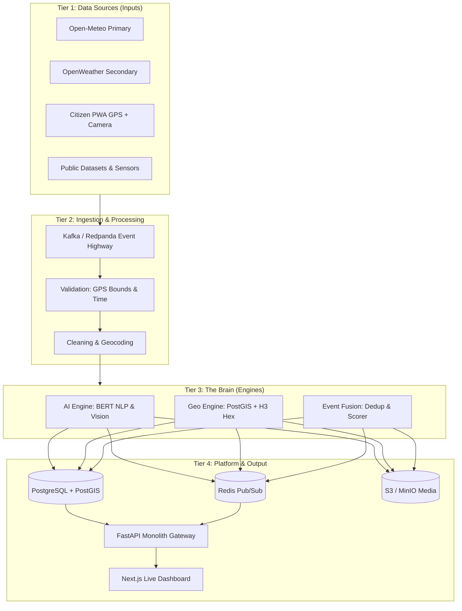

<div align="center">

# 🌩️ INDRA
### **Intelligent National Disaster & Weather Platform**
*From fragmented weather reports to verified, actionable weather events.*

[](https://sih.gov.in/)
[](https://sih.gov.in/)
[](https://sih.gov.in/)
[](#team-sixth-sense)
[](LICENSE)

---

**FastAPI** • **PostgreSQL + PostGIS** • **Uber H3** • **Redpanda / Kafka** • **Redis** • **PyTorch / NLP** • **Next.js**

</div>

---

## 📌 Problem Statement Overview

- **Problem Statement ID**: `SIH26069`
- **Problem Statement Title**: National Weather Big Data Analytics Platform
- **Theme**: Disaster Management
- **Category**: Software
- **Team Name**: Sixth Sense

---

## 💡 Core Philosophy: Intelligence Platform vs Weather App

> **"We are building an intelligence platform, not a weather app."**

Standard weather apps answer: *"What is the weather in Patna?"* (1 API request $\rightarrow$ 1 UI update).  
**INDRA** answers: **"What weather events are happening, how severe are they, how reliable is the data, and what is the underlying verifiable evidence?"**

```
Standard Weather App:
[1 API Request] ────────────────────────► [1 UI Update] (Basic CRUD)

INDRA Platform:
[Asynchronous Signal A] ┐
[Asynchronous Signal B] ┼──► [AI / Geo Fusion Layer] ──► [1 Verified Weather Event]
[Asynchronous Signal C] ┘    • Deep Learning             • Event ID: WX-EV-28231827-A
                             • Anomaly Detection         • Confidence: 94% [HIGH]
                             • PostGIS & Uber H3 Hex     • Evidence: 12 Distinct Sources
```

---

## 📖 Executive Summary & Case Study (127 $\rightarrow$ 1)

During acute crises (cloudbursts, flash floods, cyclones), emergency dispatchers face severe **alert fatigue and report fragmentation**. INDRA ingests scattered citizen mobile reports, tweets (`#IMD`, `#PatnaRains`), public river gauges, and weather APIs, consolidating them into **one verified event** with an explainable evidence receipt.

```
       127 SCATTERED SIGNALS                            1 VERIFIED EVENT
┌──────────────────────────────────┐          ┌───────────────────────────────────┐
│ • 64 Citizen app reports         │          │ PATNA URBAN FLOOD EVENT           │
│ • 48 Social media #IMD posts     │  ═════>  │ • Event ID: WX-EV-28231827-A      │
│ • 3 Weather API / AWS readings   │  INDRA   │ • Severity: CRITICAL              │
│ • 2 CWC River Level Gauges       │          │ • Confidence: 94% [AUTO-PUBLISHED]│
│ • 10 Verified media photos       │          │ • Reports: 103 Verified | 8 Susp. │
└──────────────────────────────────┘          └───────────────────────────────────┘
```

---

## ⚖️ Decoupling Confidence from Severity: The 2×2 Matrix

Disaster response demands separating **how dangerous an event is** (Severity) from **how certain we are that it is happening** (Confidence):

| | Low Confidence | High Confidence |
| :--- | :--- | :--- |
| **High Severity (Critical)** | **UNVERIFIED THREAT**<br>*(e.g., 1 report of a dam break)*<br>👉 **Flag for Immediate Human Review** | **CRITICAL VERIFIED EVENT**<br>*(e.g., Patna flood with 100+ reports)*<br>🚨 **Trigger Immediate Public & NDRF Alert** |
| **Low Severity (Advisory)** | **NOISE**<br>*(e.g., Uncorroborated rumor or tweet)*<br>🧹 **Filter & Ignore** | **CONFIRMED MINOR EVENT**<br>*(e.g., Verified localized puddle)*<br>ℹ️ **Monitor; no alert dispatch** |

---

## 🏛️ The Three-Pillar Core Engine

| 1. COLLECT | 2. UNDERSTAND | 3. VERIFY |
| :--- | :--- | :--- |
| **Pulls fragmented reports into one stream** | **Extracts multi-modal intelligence, not just keywords** | **Confirms an event only when independent sources agree** |
| • Open-Meteo (Primary API) <br>• OpenWeather (Secondary API) <br>• Citizen Mobile PWA (GPS + Camera) <br>• Social media & `#IMD` posts <br>• CWC River Gauges & IMD AWS | • BERT / Sentence Transformers NLP <br>• Coordinate validation & Geocoding <br>• PostGIS `ST_ClusterDBSCAN` <br>• Uber H3 Hexagonal Spatial Indexing <br>• PyTorch/OpenCV image flood checks <br>• Isolation Forest anomaly detector | • **The Verification Receipt (100 pts)** <br>• $\ge 2$ independent source consensus <br>• Weather station agreement <br>• Spatio-temporal proximity (GPS + Time) <br>• Unalterable SHA-256 audit trail <br>• Human-in-the-loop review queue |

---

## 🧾 The Verification Receipt

INDRA does not output an opaque score; it calculates an **explainable, unalterable audit receipt**:

$$\text{Confidence} = 25\% (\text{Weather}) + 20\% (\text{Reports}) + 20\% (\text{Spatio-Temporal}) + 15\% (\text{Vision}) + 15\% (\text{Reliability}) + 5\% (\text{Anomaly})$$

```
┌────────────────────────────────────────────────────────────────────────┐
│                        THE VERIFICATION RECEIPT                        │
│                     CONFIDENCE SCORE: 94 / 100                         │
├────────────────────────────────────────────────────────────────────────┤
│  ✓ Weather Agreement (25%)          : Open-Meteo & AWS recorded 92mm   │
│  ✓ Independent Reports (20%)        : 103 verified independent reports │
│  ✓ Location & Time Consistency (20%): PostGIS & H3 cluster within 0.8km│
│  ✓ Image Evidence (15%)             : PyTorch floodwater prob: 0.91    │
│  ✓ Source Reliability (15%)         : Verified app users & AWS sensors │
│  ✓ Historical Anomaly (5%)          : 140mm vs 35mm seasonal baseline   │
└────────────────────────────────────────────────────────────────────────┘
```

### Review Thresholds
- **$> 90\%$ (Auto-Verified)**: Auto-published to Command Center and emergency responders.
- **$60\% - 90\%$ (Probable)**: Flagged for Emergency Analyst review with pre-compiled evidence.
- **$< 60\%$ (Suspicious)**: Quarantined in buffer; escalated if Severity is Critical.

---

## 🏗️ System Architecture: The Four Tiers



---

## 🚀 Deployment Strategy: Modular Monolith

To avoid the anti-pattern of managing 15 microservices during a hackathon sprint, INDRA is architected as a **Modular Monolith**:
- **FastAPI Monolith**: Encapsulates Auth, Citizen PWA API, Weather Ingestion, Alert Queries, and WebSocket feeds.
- **Regulated AI Worker**: Isolates CPU/GPU-intensive NLP, OpenCV vision checks, and DBSCAN clustering.
- **Kafka / Redpanda Highway**: High-speed buffer absorbing sudden surges (e.g. 10,000 simultaneous reports) without dropping packets.
- **One-Command Setup**: Entire infrastructure orchestrated via `docker compose up`.

---

## 🎬 The SIH Demonstration Sequence (10 Scenes)

| Scene | Phase | Description |
| :---: | :--- | :--- |
| **Scene 1** | **Baseline** | India map normal. Open-Meteo live API stream active. Zero false alerts. |
| **Scene 3** | **The Spike** | `run_patna_demo.py` triggers a cloudburst surge. 127 reports enter via Kafka in seconds. |
| **Scene 5** | **Fusion** | BERT detects flood; PostGIS + H3 merges 127 signals into 1 geographic event polygon. |
| **Scene 7** | **Evidence** | PyTorch CV confirms waist-deep water; Open-Meteo confirms 92mm rainfall anomaly. |
| **Scene 8** | **Intelligence** | INDRA calculates **94% Confidence** and prints the explainable Verification Receipt. |
| **Scene 10** | **Action** | WebSocket pushes live red hazard zone to Next.js dashboard; auto-dispatches NDRF alert. |

---

## 📁 Repository Structure

```
INDRA/
├── docker-compose.yml              # PostgreSQL + PostGIS, Redis, Redpanda stack
├── .env.example                    # Environment variable configuration template
├── LICENSE                         # MIT License
├── README.md                       # Master documentation & blueprint
├── docs/
│   └── ARCHITECTURE.md             # Detailed engineering & mathematical specification
├── backend/
│   ├── app/
│   │   ├── api/                    # REST routes (reports, events, ingestion, analytics)
│   │   ├── core/                   # Configuration, security, database connectors
│   │   ├── models/                 # SQLAlchemy & PostGIS schemas, Pydantic DTOs
│   │   ├── services/               # Fusion engine, NLP deduplication, geospatial clustering
│   │   └── workers/                # Kafka consumer workers & background tasks
│   └── requirements.txt            # Python dependencies
├── frontend/
│   ├── package.json                # Next.js / React dependencies
│   ├── public/                     # Static assets & icons
│   └── src/
│       ├── app/                    # Next.js App Router pages
│       └── components/             # Command center UI, Leaflet/MapLibre maps, alert feeds
├── data/
│   └── samples/
│       └── patna_flood_scenario.json  # 127-report Patna flood verification dataset
└── scripts/
    └── run_patna_demo.py           # 10-Scene SIH demonstration simulation runner
```

---

## 🛠️ Quick Start & Local Setup

### Prerequisites
- **Python 3.11+** (Tested on Python 3.14)
- **Node.js 18+** & **npm**
- **Docker & Docker Compose**

### 1. Clone & Setup Environment
```bash
git clone https://github.com/SabaSaiid/INDRA.git
cd INDRA
cp .env.example .env
```

### 2. Start Core Infrastructure (PostGIS, Redis, Redpanda)
```bash
docker compose up -d
```
Verify all services are running:
```bash
docker compose ps
```

### 3. Setup and Launch Backend
```bash
cd backend
python3 -m venv .venv
source .venv/bin/activate
pip install -r requirements.txt
uvicorn app.main:app --reload --port 8000
```
Interactive Swagger API documentation: `http://localhost:8000/docs`

### 4. Setup and Launch Command Center Frontend
```bash
cd ../frontend
npm install
npm run dev
```
Open `http://localhost:3000` to access the **INDRA Live Command Center**.

### 5. Run the 10-Scene Patna Demonstration
```bash
python3 scripts/run_patna_demo.py
```
Witness 127 incoming chaotic signals condense in real-time into 1 verified critical flood event with a 94% Confidence Receipt.

---

## 👥 Team Sixth Sense

Developed for **Smart India Hackathon 2026** under Problem Statement **SIH26069** (*National Weather Big Data Analytics Platform*).

* **Repository**: [github.com/SabaSaiid/INDRA](https://github.com/SabaSaiid/INDRA)
* **Organization**: Ministry of Earth Sciences / Disaster Management Authorities
* **License**: [MIT License](LICENSE)
