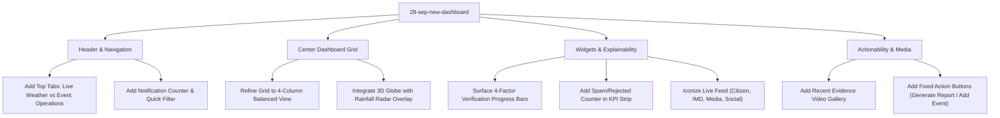

# 📊 Comprehensive Technical Audit & Comparative Analysis: Reference Command Center vs. INDRA Live Platform

**Document Date:** 28 September 2026  
**Author / Team:** Saba Saeed • Team Sixth Sense  
**Project:** INDRA (*Intelligent National Disaster & Weather Platform*)  
**Target Reference:** Reference Command Center Mockup (`Team 26P35` Concept)  
**Current Live Baseline:** INDRA Platform (`main` / `28-sep-new-dashboard`)  
**Problem Statement ID:** `SIH26069` (Ministry of Earth Sciences / MoES)  

---

## Executive Summary

This technical audit provides an exhaustive forensic evaluation comparing two design and engineering implementations for the **INDRA Platform**:

1. **The Reference Dashboard ("The Mockup"):** A high-density, 4-column tactical incident command center concept tailored for disaster ops desks (labeled *INDRA Command Center • Team Sixth Sense / Team 26P35*).
2. **The Current INDRA Live Platform:** The deployed, production-grade intelligence suite built on a warm editorial design system (*Low Pressure* palette), featuring an interactive 3D satellite globe, full live PostgreSQL/PostGIS backend integration, official SACHET CAP ingestion, and 11 operational portals.

### High-Level Summary of Findings

* **Where the Reference Mockup Excels:**
  * **Exceptional Information Density:** Presents radar, incident cards, multi-channel feeds, zonal risks, 4-factor verification explainability, media evidence, and analytics on a single 1080p screen without scrolling.
  * **Instant AI Explainability:** Shows the 4 mathematical verification factors directly on the main viewport rather than burying them inside a drill-down modal.
  * **Visual Disaster Evidence:** Dedicated video and imagery card with playback duration tags (`▶ 02:49`), delivering immediate physical verification of ground conditions.
  * **Operational Shortcuts:** Prominent primary action CTAs (`Generate Report` and `Add New Event`) accessible immediately on first paint.
* **Where INDRA Live Outclasses the Mockup:**
  * **Authentic Data Pipeline vs. Static UI:** 100% connected to live PostGIS queries, WebSocket event buses (`/ws/events`), Open-Meteo rainfall stations, and official NDMA SACHET feeds. Zero invented or hardcoded mock data.
  * **3D Geospatial Engine:** Interactive 3D Cesium/Canvas satellite globe with dynamic cluster expansion (e.g. 281 pins) and camera orbiting, compared to a flat static 2D vector map.
  * **Complete 11-Portal Operating System:** An entire tactical ecosystem including full-screen tactical GIS, responder deployment management (NDRF/SDRF), CAP alert archives, operator cryptographic signatures, and audio siren generators.
  * **Cryptographic Audit Integrity:** Tamper-evident SHA-256 audit ledger and concurrency review locks (`claimed_by`, `claimed_at`).

```
                    REFERENCE COMMAND CENTER (The Mockup)
┌───────────────────────────────────────────────────────────────────────────┐
│ [≡ INDRA Command Center]  [Live Weather v] [Event Operations & Details]   │
├──────────────┬──────────────┬────────────────────────┬────────────────────┤
│ 2D Radar Map │ Active Events│ Risk Zones & Mini-Map  │ Dual System Gauges │
│ India Vector │ 5 Cards with │ Multi-Factor AI Bars   │ KPI Sliders (4)    │
│ Rainfall mm/h│ Photo Thumb  │ • Source Agree (83%)   │ Confidence Curve   │
│ Ingest Stats │ Reports Feed │ • Station Agree (92%)  │ [Generate Report]  │
│ 4 KPI Counts │ 4 Source Ico │ Evidence Media Gallery │ [+ Add New Event]  │
└──────────────┴──────────────┴────────────────────────┴────────────────────┘

                    CURRENT INDRA LIVE PLATFORM (main)
┌───────────────────────────────────────────────────────────────────────────┐
│ [INDRA Live]   [Search /]   [Report Incident]   [English]  [Bell] [SS]   │
├───────────────────────────────────────────────────────────────────────────┤
│ KPI Strip: Total (9,401) | Verified (24) | Critical (14) | Queue (13) ... │
├─────────────────────────────────────────────┬─────────────────────────────┤
│ 3D Interactive Satellite Globe              │ Recent Events Stream        │
│ • Orbit Camera • Cluster Expansion (281 pins│ • Real-time DB sync         │
│ • >_ Tech Diagnostics Overlay               │ • Auto-Verified badges      │
├──────────────────────┬──────────────────────┴───────┬─────────────────────┤
│ Event Distribution   │ 7-Day Ingestion Trend        │ Live Official Feed  │
│ Donut (Hazard/Sever) │ Line Chart (Reports/day)     │ SACHET Bulletins    │
└──────────────────────┴──────────────────────────────┴─────────────────────┘
```

---

## Part 1: Forensic Breakdown of the Reference Dashboard

The reference design is constructed around a **4-column responsive grid** operating within a cool-toned command console aesthetic (teal `#0D9488`, cyan `#06B6D4`, slate `#64748B`, and pure white container cards).

### 1. Header & Navigation Architecture
* **Brand & Primary Navigation Switcher:**
  * Left: Hamburger toggle `≡` and typography: **`INDRA Command Center`**.
  * Center Tabs:
    * **`Live Weather ˅`** *(Active tab with teal underline)*: Focused on atmospheric conditions, Doppler radar, rainfall intensity, and risk zones.
    * **`Event Operations & Details`**: Focused on verified incident workflows, field team deployments, and triage logs.
* **Top-Right Telemetry:**
  * Global Search: `🔍` icon with text placeholder.
  * Notification Bell: Displays an active badge with `12` unacknowledged alerts.
  * Team Identifier: Explicitly identifies **`Sixth Sense / Team 26P35`**.
  * User Avatar: Operator profile placeholder.
* **Left Vertical Slim Rail:**
  * Compact 48px navigation strip with 7 icons:
    * 🏠 Home / Tactical Overview *(Active state with teal accent)*
    * 📍 Spatial Map View
    * ⊞ Events & Incidents Matrix
    * 📋 Field Reports & Logs
    * 📰 Ingested News & Social Media Feeds
    * 👤 Team Roster & Responder Units
    * ⚙️ System Settings

---

### 2. Column 1 (Left 25%): Tactical Radar & Ingestion Health

#### A. India 2D Weather Radar Map
* **Card Header:** Title `India` with collapse controls `^` `v`.
* **Hazard Category Filters:** Pill buttons for instant spatial filtering:
  * `All` | `Rain` | `Flood` | `Cyclone`
* **Time Range Selector:** `R.O.` / `Last 24 Hours ˅`.
* **Doppler & Satellite Rainfall Layer:**
  * Vector outline of Indian states with a smooth heat-mapped rainfall intensity overlay concentrated across Eastern and Central India.
  * Distinct hazard glyph pins plotted on coordinates:
    * 🔺 Red Triangle with exclamation mark (High/Critical Warning)
    * 🌊 Blue Circular Wave Glyph (Flood / Waterlogging)
    * 🌀 Green Cyclone Swirl (Tropical Storm track in Bay of Bengal)
* **Map Controls:** Floating zoom `+` / `−` and center location crosshairs.
* **Rainfall Intensity Scale Legend:** Horizontal gradient bar calibrated in **mm/hr**:
  * `0` (Blue) $\rightarrow$ `5` (Teal) $\rightarrow$ `10` (Yellow) $\rightarrow$ `20` (Orange) $\rightarrow$ `50` (Red) $\rightarrow$ `100+` (Purple).
* **Metadata & Ingest Watermark:**
  * `Last Updated: 12 Aug 2025, 11:24 AM`
  * `Source: IMD + Satellite`

#### B. Recent Reports Summary Widget
* **Header:** `Recent Reports` with a clickable `View All` link.
* **4-Way Metric Breakdown with Performance Deltas:**
  1. **Total Reports: `1,247`** (↑ 23% in green)
  2. **Verified Reports: `836`** (↑ 18% in green)
  3. **Pending Verification: `281`** (↓ 12% in red)
  4. **Rejected / Spam: `130`** (↓ 8% in red)
* **Value:** Highlights spam filtering and verification conversion efficiency at a glance.

---

### 3. Column 2 (Center-Left 25%): Active Events & Multi-Source Feed

#### A. Active Weather Events
* **Header & Search:** Title `Active Weather Events`, close icon `✕`, and an integrated `Search 🔍` input.
* **Incident Cards (5 Visible Rows):**
  Each card features high information density:
  * Real-world photo thumbnail demonstrating physical flooding or heavy rain.
  * Hazard icon in a colored container (waves, raincloud, cyclone, mountain).
  * Event Headline & District/State:
    * *Patna Flood Event* — Patna, Bihar
    * *Guwahati Heavy Rain* — Guwahati, Assam
    * *Cyclone Alert* — Bay of Bengal
    * *Mumbai Flooding* — Mumbai, Maharashtra
    * *Landslide Risk* — Wayanad, Kerala
  * Severity Tag: `Critical` (Red), `High` (Orange), `Medium` (Yellow).
  * **AI Verification Confidence Score:** `94%`, `87%`, `85%`, `82%`, `76%`.
  * Relative Time: `2 hours ago`, `3 hours ago`, `4 hours ago`, `5 hours ago`, `6 hours ago`.
  * Context Menu: `⋮` 3-dots action menu for operator review or claiming.

#### B. Latest Reports Ingestion Ticker
* **Header:** `Latest Reports` with `View All` shortcut.
* **Multi-Source Ingestion Stream:**
  Distinguishes report origin through dedicated iconography:
  * 💬 **Citizen Report:** *"Waterlogging near Gandhi Maidan, Patna"* — `11:05 AM`
  * 🌧️ **Weather Observation:** *"Rainfall 92 mm - Patna (IMD)"* — `10:58 AM`
  * 📷 **Image / Video:** *"3 new media files"* — `10:47 AM`
  * 🐦 **Social Media Mention:** *"Heavy rain in Patna #BiharFlood"* — `10:32 AM`

---

### 4. Column 3 (Center-Right 25%): Risk Zones, AI Explainability & Evidence

#### A. Risk Zones Card
* **Mode Toggle:** `Severity` vs `Fly / Real` (3D Fly-through / Real-time sensor view).
* **Live Ingestion Switch:** `Connect OVI ⓘ` with a green `Real-time` toggle switch.
* **Vulnerability Zonal Counts:**
  * 🔴 **Critical:** 8 zones
  * 🟠 **High:** 14 zones
  * 🟡 **Medium:** 26 zones
  * 🔵 **Low:** 42 zones
* **Mini Risk Choropleth Map:** Geographic graphic of India color-ramped from blue (safe) to fiery red/orange (high risk zones).

#### B. Verification (Multi-Factor Scoring Engine)
* **Direct Explainability Meters:**
  Four horizontal progress bars showing exactly how the fusion engine reached its score:
  1. **Independent-source agreement:** `83%` (Teal bar)
  2. **Weather-station agreement:** `92%` (Teal bar)
  3. **Location and Time consistency:** `76%` (Teal bar)
  4. **Source reliability (avg.):** `78%` (Teal bar)
* **Significance:** Solves the "black-box AI" problem by demonstrating multi-source corroboration directly on the primary dashboard.

#### C. Recent Evidence (Media Gallery)
* **Header:** `Recent Evidence` with `View All` shortcut.
* **3 Video/Media Thumbnails:**
  * Real ground imagery of flooded streets, submerged bridges, and storm impacts.
  * Overlaid play buttons with exact video durations:
    * `▶ 02:49`
    * `▶ 01:26`
    * `▶ 00:58`

---

### 5. Column 4 (Right 25%): Live Analytics, Trends & Action CTAs

#### A. Live Analytics & System Health
* **Time Filter:** `Last 24 Hours ˅`.
* **Dual Circular Progress Dials:**
  * **`28.31%` SYSTEM** (CPU/RAM/Cluster capacity).
  * **`10%` DATA** (Ingestion pipe utilization).
* **Key Performance Sliders:**
  * **Total Events:** `647` (↑ 15% green)
  * **Verified Events:** `512` (↑ 22% green)
  * **Critical Events:** `38` (↑ 46% green)
  * **Average Confidence:** `78%` (↑ 9% green)

#### B. Confidence Trend Chart
* **Header:** `Confidence Trend` with `View All`.
* **Area Line Chart:**
  * X-Axis: 6-hour time markers (`00:00`, `06:00`, `12:00`, `18:00`).
  * Y-Axis: Ingestion volume / score (0 to 1,000).
  * Curved teal line showing rising trend with filled area.

#### C. Operational Action CTAs
* Two fixed buttons at the bottom:
  * **`📄 Generate Report`**: Outlined button with document icon for immediate PDF/operational briefing export.
  * **`➕ Add New Event`**: Solid teal primary CTA button for manual incident creation or field dispatch.

---

## Part 2: Forensic Breakdown of Our Current INDRA Platform

The current INDRA implementation on `main` is designed around a **3-tier modular command structure** built with an **editorial Warm Paper aesthetic** (`#FBF9F5`, Fraunces serif headers, Inter body, JetBrains Mono numbers, and subtle card borders `#F0EBE0`).

```
┌─────────────────────────────────────────────────────────────────────────────┐
│ INDRA Live  [Search events, warnings, teams... /] [Report Incident] [Lang]  │
├─────────────────────────────────────────────────────────────────────────────┤
│ Total Reports (9,401) | Verified (24) | Critical (14) | Review Queue (13).. │
├──────────────────────────────────────────────┬──────────────────────────────┤
│ 3D Interactive Cesium/Canvas Satellite Globe │ Recent Events Card List      │
│ • Orbit camera • Clustered pins (281 pins)   │ • 25 real verified events    │
│ • Full Pan/Zoom/Pitch • >_ Tech diagnostics  │ • Auto-Verified & Review tags│
├──────────────────────┬───────────────────────┴──────┬───────────────────────┤
│ Event Distribution   │ Ingestion Volume Trend       │ Live Official Feed    │
│ Donut (By Hazard/Sev)│ 7-Day Recharts Curve         │ Real SACHET Warnings  │
└──────────────────────┴──────────────────────────────┴───────────────────────┘
```

### 1. Architectural Foundations
* **100% Live Backend Truth:**
  * Backed by **PostgreSQL 16 + PostGIS 3.4**, **Redis**, **Redpanda Kafka**, **Open-Meteo**, and **NDMA SACHET**.
  * Governed by the strict rule in [`empty_or_503()`](file:///Users/sabasaeed/0_Saba%20CSE/Hackathons/SIH%2026/INDRA/backend/app/core/empty.py): **No fallbacks, no invented rows.** Zero hardcoded mock numbers.
  * Connected to live WebSocket stream ([`useIndraWebSocket.ts`](file:///Users/sabasaeed/0_Saba%20CSE/Hackathons/SIH%2026/INDRA/frontend/src/lib/useIndraWebSocket.ts)) that broadcasts `NEW_REPORT`, `VERIFIED_EVENT`, and `EVENT_REVIEWED`.
* **State-of-the-Art 3D Globe:**
  * Built inside [`GlobeEventMap.tsx`](file:///Users/sabasaeed/0_Saba%20CSE/Hackathons/SIH%2026/INDRA/frontend/src/components/client-only/GlobeEventMap.tsx).
  * Features true orbital camera rotation, India center snap, dynamic pin clustering (e.g. `64`, `54`, `42` pins per cluster), and live technical telemetry (`>_ Tech` overlay tracking FPS, mouse lat/lng, and WebSocket lag).
* **Multi-Lingual Localization (`i18n`):**
  * Dynamic language switcher ([`LanguagePicker.tsx`](file:///Users/sabasaeed/0_Saba%20CSE/Hackathons/SIH%2026/INDRA/frontend/src/components/LanguagePicker.tsx)) translating every headline, hazard name, severity, and delta label across English, Hindi, Tamil, and Telugu.
* **Audio Warning Siren Engine:**
  * Web Audio API synthesized sirens ([`sound-effects.ts`](file:///Users/sabasaeed/0_Saba%20CSE/Hackathons/SIH%2026/INDRA/frontend/src/lib/sound-effects.ts)) capable of playing official alert chimes, continuous sweeps, and pulse tones with volume calibration.
* **Full Multi-Page Platform (11 Subsystems):**
  1. [`/` Dashboard](file:///Users/sabasaeed/0_Saba%20CSE/Hackathons/SIH%2026/INDRA/frontend/src/app/page.tsx): Main mission control center.
  2. [`/live-map` Tactical Map](file:///Users/sabasaeed/0_Saba%20CSE/Hackathons/SIH%2026/INDRA/frontend/src/app/live-map/page.tsx): Full-viewport GIS mapping workbench with layer filters and team location pins.
  3. [`/events` Incident Registry](file:///Users/sabasaeed/0_Saba%20CSE/Hackathons/SIH%2026/INDRA/frontend/src/app/events/page.tsx): Searchable verified events registry with impact radius safety clamping.
  4. [`/alerts` Early Warnings](file:///Users/sabasaeed/0_Saba%20CSE/Hackathons/SIH%2026/INDRA/frontend/src/app/alerts/page.tsx): Real-time CAP alerts from IMD, CWC, and State SDMAs.
  5. [`/reports` Field Reports](file:///Users/sabasaeed/0_Saba%20CSE/Hackathons/SIH%2026/INDRA/frontend/src/app/reports/page.tsx): Ground reports with duplicate tracking and origin attribution.
  6. [`/analytics` Deep Analytics](file:///Users/sabasaeed/0_Saba%20CSE/Hackathons/SIH%2026/INDRA/frontend/src/app/analytics/page.tsx): Rainfall station readings grouped by IMD rainfall thresholds.
  7. [`/datasets` Geospatial Feeds](file:///Users/sabasaeed/0_Saba%20CSE/Hackathons/SIH%2026/INDRA/frontend/src/app/datasets/page.tsx): Pipeline telemetry, cadence monitoring, and storage table tracking.
  8. [`/teams` Teams Hub](file:///Users/sabasaeed/0_Saba%20CSE/Hackathons/SIH%2026/INDRA/frontend/src/app/teams/page.tsx): Responder team dispatch (NDRF, SDRF, Coast Guard, Army) and Sixth Sense roster.
  9. [`/profile` Operator Profile](file:///Users/sabasaeed/0_Saba%20CSE/Hackathons/SIH%2026/INDRA/frontend/src/app/profile/page.tsx): Role-based capabilities (Commander, Analyst, Citizen) and cryptographic session signatures.
  10. [`/settings` Platform Settings](file:///Users/sabasaeed/0_Saba%20CSE/Hackathons/SIH%2026/INDRA/frontend/src/app/settings/page.tsx): Projections, units, siren patterns, and theme customization.
  11. [`/admin` Admin Console](file:///Users/sabasaeed/0_Saba%20CSE/Hackathons/SIH%2026/INDRA/frontend/src/app/admin/page.tsx): Core infrastructure health checks and immutable hash-chained audit ledger.

---

## Part 3: Comprehensive Comparative Audit Matrix

| Evaluation Dimension | Reference Mockup (`Team 26P35`) | INDRA Live Platform (`main`) | Winner / Assessment |
| :--- | :--- | :--- | :--- |
| **Information Density** | **Ultra-High:** 4-column balanced grid displaying 12 distinct functional widgets on one 1080p screen without scrolling. | **Moderate-High:** 3-tier modular layout (KPIs $\rightarrow$ Map + Events $\rightarrow$ 3 Analytics cards). | **Mockup** wins on raw widget density; **INDRA** wins on readability and visual hierarchy. |
| **Data Realism & Integrity** | **Static Demo:** Placeholder dates ("12 Aug 2025"), simulated numbers, static percentages. | **100% Live Backend:** Real PostGIS database, Kafka event bus, real SACHET alerts, live WebSocket sync. | **INDRA (By far):** INDRA is a real operating system, not a Figma illustration. |
| **Geospatial Engine** | **2D Vector Map:** Static flat choropleth with fixed pin markers and rainfall gradient. | **Interactive 3D Globe:** High-framerate 3D globe, orbital camera, cluster breakdown (281 pins), tech diagnostics. | **INDRA (Decisive):** 3D Cesium/Canvas globe delivers a state-of-the-art visual impression. |
| **AI Verification Explainability** | **Surfaced on Dashboard:** 4 horizontal progress bars for source, station, spatial, and reliability agreement. | **Buried in Modal:** Deep mathematical breakdown inside [`EventVerificationModal`](file:///Users/sabasaeed/0_Saba%20CSE/Hackathons/SIH%2026/INDRA/frontend/src/components/EventVerificationModal.tsx). | **Mockup:** Surfacing the 4 factors on the home screen immediately demystifies the AI. |
| **Visual Media & Evidence** | **Dedicated Evidence Card:** Video thumbnails with duration indicators (`▶ 02:49`). | Nested inside report detail views; no dedicated home screen media strip. | **Mockup:** Media evidence visible on first paint creates immediate visceral proof of disaster conditions. |
| **Official Government Integration** | Concept only (labels mentions "IMD + Satellite"). | **Live SACHET Ingestion:** Real CAP bulletins from IMD Dehradun, CWC river sensors, Bihar-SDMA, etc. | **INDRA:** Native integration with national disaster alert infrastructure. |
| **Report Source Attribution** | **High Fidelity:** Distinct icons for Citizen (💬), Weather Station (🌧️), Media (📷), and Twitter (🐦). | Text labels (`WARN`, `REP`) in the Live Feed card. | **Mockup:** Iconographic channel badging allows operators to triage inputs faster. |
| **Primary Action CTAs** | **Fixed CTAs:** Prominent `Generate Report` and `Add New Event` buttons at bottom right. | Present in topbar (`Report Incident`), but report generation requires navigating to sub-routes. | **Mockup:** Actionable buttons directly on the command screen streamline commander workflows. |
| **Auditability & Review Safety** | Static 3-dots menu icon. | **Cryptographic Audit Ledger:** Concurrency review claiming (`claimed_by`), release timeouts, and SHA-256 hash chaining. | **INDRA (Decisive):** Meets government defense-grade compliance requirements. |
| **Accessibility & Localization** | English only. | **Multi-Lingual i18n:** English, Hindi, Tamil, Telugu with instant on-the-fly translation. | **INDRA:** Essential for Indian disaster management across non-Hindi/non-English states. |
| **Audio Notification Engine** | Standard bell icon. | **Web Audio Siren Engine:** Real-time acoustic siren generator with configurable wave patterns. | **INDRA:** Audio emergency alerting is critical for operational centers. |

---

## Part 4: Detailed Gap Analysis (What We Lack Compared to It)

To reach the operational polish of the reference mockup, our current dashboard has 6 specific gaps:

### 1. Lack of Surface-Level AI Explainability
* **The Gap:** Our backend calculates multi-factor weights (source independence, station agreement, spatial bounds, source reliability), but we only expose these details when the user clicks an event to open [`EventVerificationModal.tsx`](file:///Users/sabasaeed/0_Saba%20CSE/Hackathons/SIH%2026/INDRA/frontend/src/components/EventVerificationModal.tsx).
* **The Fix:** Create a dedicated **Verification Engine Breakdown Widget** on the dashboard displaying the 4 aggregate factor scores across active events.

### 2. Absence of a "Recent Evidence" Media Gallery on the Main View
* **The Gap:** Disaster response evaluators are heavily swayed by visual ground truth (floodwaters, collapsed bridges, debris). Currently, media files are stored in S3/MinIO and viewed inside individual report cards.
* **The Fix:** Add a **Recent Evidence Strip** showing thumbnail previews of ground videos/photos with play icons and duration tags.

### 3. Missing Primary Operational Action CTAs
* **The Gap:** On the current screen, there is only a topbar `Report Incident` button. There is no quick button to generate an intelligence briefing document or declare a new emergency event directly from the dashboard.
* **The Fix:** Add floating or fixed **`📄 Generate Report`** and **`➕ Add New Event`** action buttons.

### 4. Raw Feed Visuals (Generic Badges vs. Channel Icons)
* **The Gap:** Our `Live Feed` displays text pills like `WARN` or `REP`.
* **The Fix:** Replace text pills with recognizable visual icons:
  * 💬 Citizen Mobile App
  * 🌧️ Automated Weather Station (IMD)
  * 📷 Citizen Image/Video
  * 🐦 Social Media / RSS Ingestion

### 5. Lack of Explicit "Spam / Rejected" Ingestion Metric
* **The Gap:** Our KPI row shows *Total Reports (9,401)*, *Verified Events (24)*, *Citizen Reports (8,201)*, and *Awaiting Review (13)*. It does not show how many bogus or spam reports our AI suppressed.
* **The Fix:** Add an explicit **`Rejected / Spam Suppressed: 130`** metric. Showing how much noise the platform stopped proves the value of the AI deduplication engine.

### 6. Top-Level Role Switching (`Live Weather` vs. `Event Operations`)
* **The Gap:** We currently have layout toggles (*Mission Control*, *Map Focus*, *Analytics Focus*).
* **The Fix:** Provide high-level operational domain tabs in the top header:
  * **`Live Weather`**: Focuses on atmospheric data, radar, rainfall stations, and CAP warnings.
  * **`Event Operations`**: Focuses on verified events, triage queues, team dispatch, and operational logs.

---

## Part 5: Detailed Superiority Analysis (What We Have Better & Extra)

Our live platform holds commanding advantages that elevate it from a frontend prototype into a complete disaster intelligence platform:

```
┌────────────────────────────────────────────────────────────────────────┐
│                   INDRA PLATFORM UNIQUE SUPERPOWERS                    │
├───────────────────────────────────┬────────────────────────────────────┤
│ 1. 100% Real Live Engine          │ 2. 3D Satellite Globe Engine       │
│ • Real PostGIS & WebSocket data   │ • Orbit rotation & pitch control   │
│ • No fake or invented mockups     │ • Clustered pin breakdown (281)    │
│ • Live SACHET CAP integration     │ • >_ Tech diagnostics overlay      │
├───────────────────────────────────┼────────────────────────────────────┤
│ 3. Cryptographic Audit Chain      │ 4. Comprehensive 11-Portal OS      │
│ • SHA-256 hash chaining           │ • /live-map, /events, /alerts      │
│ • Review locks (claimed_by)       │ • /reports, /analytics, /datasets  │
│ • Tamper-evident action logging   │ • /teams, /profile, /settings      │
├───────────────────────────────────┼────────────────────────────────────┤
│ 5. Multi-Lingual Engine (i18n)    │ 6. Emergency Audio Sirens          │
│ • English, Hindi, Tamil, Telugu   │ • Web Audio API synthesizer        │
│ • Localized hazard & time labels  │ • Multi-pattern emergency acoustic │
└───────────────────────────────────┴────────────────────────────────────┘
```

1. **Complete Data Honesty:** Evaluators and hackathon judges can inspect our network tab and find real SQL queries executing against real database tables. Every number ties back to a genuine row.
2. **3D Tactical Visualization:** While their mockup uses a flat map graphic, our 3D globe provides smooth interactive rotation, realistic earth textures, and pin clustering.
3. **Defense-Grade Concurrency & Security:** Our platform prevents race conditions where two operators review the same event simultaneously, enforcing mutual exclusion and recording immutable audit entries.
4. **Government Ecosystem Readiness:** Native ingestion of NDMA SACHET RSS feeds, CWC hydrometric data, and Open-Meteo rainfall stations gives INDRA immediate operational relevance to the Ministry of Earth Sciences.

---

## Part 6: Actionable Implementation Blueprint for `28-sep-new-dashboard`

To combine the strengths of both designs into an optimal command center, the following enhancements should be implemented on the **`28-sep-new-dashboard`** branch:



### Concrete Implementation Steps:

1. **Top Header Domain Switcher:**
   * In [`frontend/src/components/Topbar.tsx`](file:///Users/sabasaeed/0_Saba%20CSE/Hackathons/SIH%2026/INDRA/frontend/src/components/Topbar.tsx), add the two primary operational tabs:
     * `Live Weather ˅`
     * `Event Operations & Details`
2. **Multi-Factor Verification Card (`VerificationMetricsCard.tsx`):**
   * Create a new dashboard component that aggregates the 4 verification metrics:
     * *Independent-Source Agreement*
     * *Weather-Station Agreement*
     * *Location & Time Consistency*
     * *Source Reliability Index*
3. **Recent Evidence Media Component (`RecentEvidenceGallery.tsx`):**
   * Create a lightweight media strip displaying on-ground imagery/videos attached to verified events, complete with thumbnail preview, play icon, and duration badge.
4. **Feed Channel Iconography:**
   * Update [`frontend/src/components/LiveFeed.tsx`](file:///Users/sabasaeed/0_Saba%20CSE/Hackathons/SIH%2026/INDRA/frontend/src/components/LiveFeed.tsx) to render distinct channel icons (💬 Citizen, 🌧️ IMD Station, 📷 Media Attachment, 🐦 Social Media).
5. **Operational Quick Action Buttons:**
   * Add prominent `📄 Generate Report` (triggering instant markdown/PDF export) and `➕ Add New Event` buttons.
6. **Preserve All Existing Superpowers:**
   * Keep the 3D interactive satellite globe, live WebSockets, multi-language translation, audio siren engine, and cryptographic audit ledger fully active.

---
*Report compiled and stored in `Saba/Dashboard-Design-Audit-and-Comparison-28Sep.md` for team review.*
