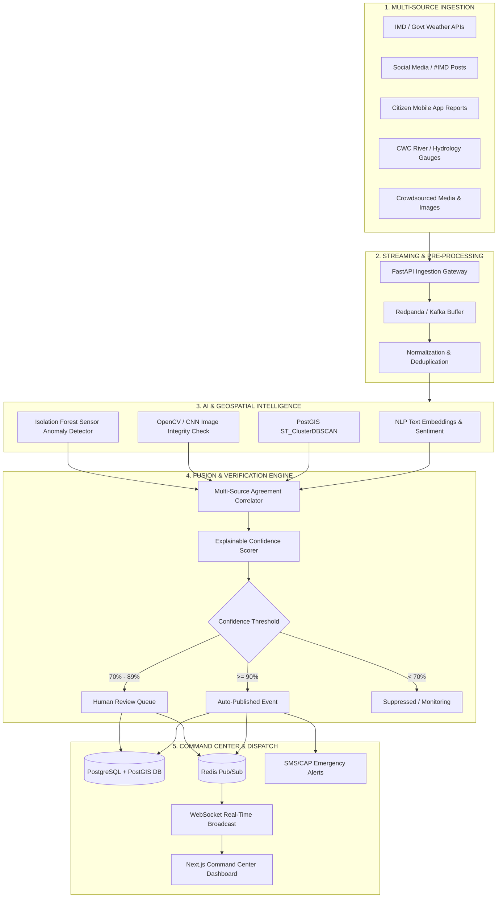

# INDRA Architecture Specification

**Project Title**: Intelligent National Disaster & Weather Platform  
**Problem Statement ID**: SIH26069 (National Weather Big Data Analytics Platform)  
**Theme**: Disaster Management  
**Team**: Sixth Sense — Smart India Hackathon 2026  

---

## 1. Executive System Architecture

INDRA is designed to solve the critical bottleneck in disaster management: **alert fragmentation and verification latency**. During extreme meteorological occurrences, government command centers are overwhelmed by hundreds of unvetted social media posts, conflicting citizen reports, and asynchronous sensor readings. 

INDRA ingests, clusters, deduplicates, and fuses multi-source signals in real-time, converting **hundreds of noisy signals into a single, explainable, verified weather event**.

---

## 2. The Five-Stage Processing Pipeline

### Stage 1: Data Sources & Ingestion
Signals arrive from disparate protocols with varying rates:
- **IMD AWS / Doppler Feeds**: High-precision, low-frequency (every 15–60 mins) REST/SFTP feeds.
- **Citizen Reports**: Geotagged user submissions with photo attachments submitted via mobile PWA.
- **Social Media / Microblogs**: Public streams filtered for hashtags (`#IMD`, `#PatnaRains`, `#CycloneAlert`).
- **Hydrological Sensors**: River gauge levels from Central Water Commission (CWC).

### Stage 2: Streaming & Pre-Processing (Kafka/Redpanda)
- **Surge Absorption**: During acute catastrophes (e.g. cloudbursts, cyclone landfall), report volume spikes by ~50x. Writing directly to PostgreSQL will exhaust connection pools and crash the API. 
- **Decoupled Buffer**: Redpanda acts as a persistent, high-throughput distributed log (`indra.raw.reports`).
- **Standardized Event Wrapper**: Ingested payloads are normalized into a unified `SignalEvent` schema before worker consumption.

### Stage 3: AI & Geospatial Intelligence
1. **Semantic Text NLP**:
   - Uses sentence embeddings (`all-MiniLM-L6-v2`) to project raw report descriptions into a 384-dimensional vector space.
   - Computes cosine similarity between incoming reports within the active time window to cluster colloquial descriptions (e.g., *"water up to waist on bypass"* vs *"heavy waterlogging near bypass road"*).
2. **Spatial Polygon Clustering (PostGIS ST_ClusterDBSCAN)**:
   - Evaluates coordinate proximity using geospatial distance metrics (`eps = 5km`, `minpoints = 2`).
   - Generates convex/concave boundary polygons representing flood inundation zones rather than single lat/lng points.
3. **Computer Vision Verification**:
   - OpenCV and lightweight CNNs verify image authenticity, detect floodwater/inundation levels, and check image metadata against submission timestamps to flag recycled or fake internet images.
4. **Sensor Anomaly Detection**:
   - Isolation Forest algorithms identify faulty or jammed physical telemetry (e.g., stuck float sensors or sudden impossible telemetry leaps).

---

## 3. Multi-Source Event Fusion Engine & Verification Math

An event is confirmed **only when independent sources agree**. Single-source spikes are never escalated directly to critical alert status.

### Confidence Score Formulation
The composite confidence score $C \in [0, 1.0]$ is computed as:

$$C = w_{sta} \cdot S_{sta} + w_{div} \cdot S_{div} + w_{spa} \cdot S_{spa} + w_{med} \cdot S_{med} + w_{rel} \cdot S_{rel}$$

Where:
- $S_{sta}$: **Weather Station Agreement** (0.0 to 1.0). Correlation between reported conditions and nearest official IMD AWS readings within 15 km.
- $S_{div}$: **Source Diversity Metric** ($1 - e^{-k \cdot N_{types}}$). Ensures reports come from multiple distinct channels (e.g., IMD + Citizen + River Gauge vs 100 bots on X).
- $S_{spa}$: **Spatio-Temporal Cohesion**. Density of signals clustering inside the PostGIS DBSCAN polygon within a $\Delta t \le 120\text{ min}$ window.
- $S_{med}$: **Multimedia Corroboration**. Proportion of submitted photos passing EXIF timestamp check and floodwater CV segmentation.
- $S_{rel}$: **Source Reliability Weight**. Historical reliability score of the contributing entities.

### Verification Thresholds & Gating

| Confidence Score | Classification | Action | Alert Level |
| :--- | :--- | :--- | :--- |
| **$\ge 90\%$** | **Verified Weather Event** | **Auto-Published** to Command Center & Dispatched to NDRF/SDMA | Level 1 (Critical / Red) |
| **$70\% - 89\%$** | **Probable Event** | Queued for **Human-in-the-Loop Review** by Disaster Officer | Level 2 (Watch / Orange) |
| **$< 70\%$** | **Unconfirmed Signal** | Retained in working memory buffer; awaiting corroborating evidence | Level 3 (Advisory / Green) |

---

## 4. Grounded Technical Choices

| Technology Chosen | Alternative Rejected | Architectural Justification |
| :--- | :--- | :--- |
| **PostGIS Geometry/Geography** | Naive Lat/Lng columns in MySQL | Floods, cyclones, and heatwaves are **spatial polygons**, not point coordinates. PostGIS enables real-time polygon intersection (`ST_Intersects`), spatial joins, and dynamic hazard risk zone calculations. |
| **Redpanda / Apache Kafka** | Direct PostgreSQL Synchronous Writes | Disaster events trigger sudden **50x to 100x traffic surges**. A streaming message broker buffers ingestion spikes without starving read queries on the operational dashboard. |
| **Sentence Transformers (NLP)** | Exact Keyword Matching | Citizens use vastly different terminology, colloquial Hindi/English expressions, and local phrasing to describe the same disaster. Embeddings capture underlying semantic intent. |
| **DBSCAN Clustering** | K-Means Clustering | K-Means requires specifying $K$ (number of disaster clusters) in advance, which is impossible during live unfolding emergencies. DBSCAN discovers arbitrary cluster shapes and naturally filters out spatial noise. |

---

## 5. Case Study: The Patna Flood Verification (127 $\rightarrow$ 1)

During the benchmark Patna Urban Inundation scenario:
1. **127 raw signals** were collected within a 90-minute window (64 citizen reports, 48 social media posts, 3 IMD stations, 2 CWC river sensors, 10 geotagged photographs).
2. The NLP pipeline grouped the 64 citizen descriptions and 48 social posts into **2 high-density text clusters**.
3. PostGIS DBSCAN consolidated the spatial points into **1 geographic polygon** over Central Patna (covering Rajendra Nagar, Kankarbagh, and Digha).
4. Official IMD station at Patna Airport recorded $82.4\text{ mm}$ rainfall, corroborating citizen claims. CWC Digha Ghat sensor confirmed river surge.
5. The Fusion Engine computed a composite confidence score of **$94\%$**.
6. **Result**: Instead of 127 alert popups overwhelming emergency operators, INDRA produced **1 verified, geo-bounded disaster incident** dispatched instantly to BSDMA and NDRF.
