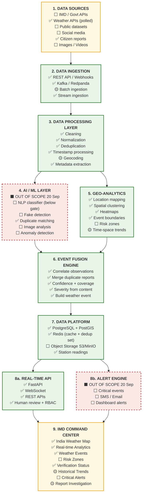
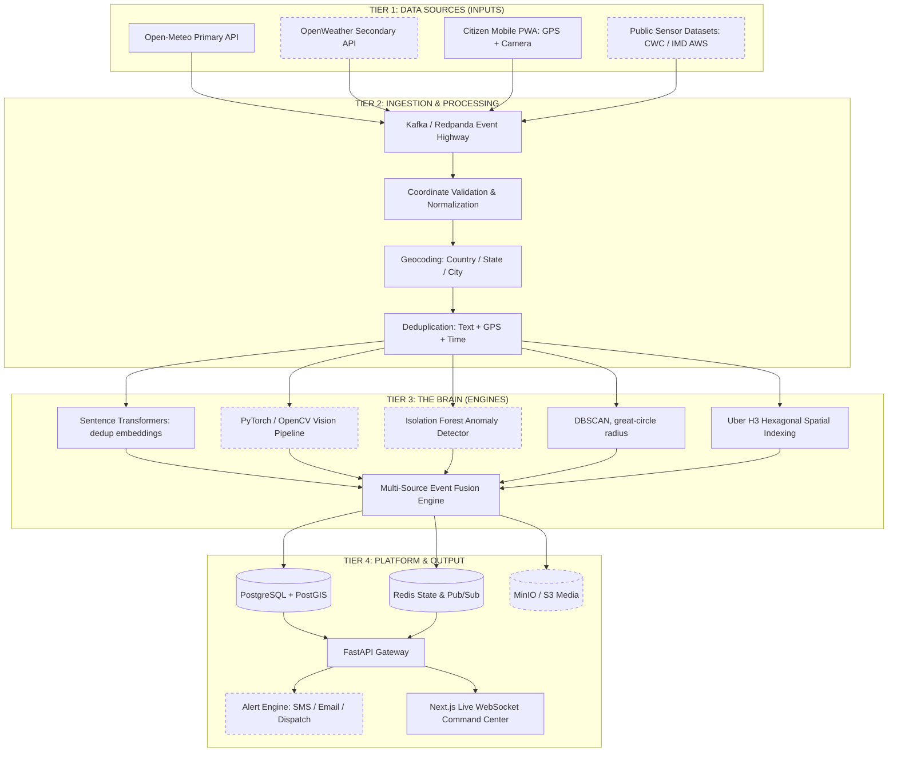

# INDRA Architecture Specification & Engineering Blueprint

**Project Title**: INDRA (Intelligent National Disaster & Weather Platform)  
**Problem Statement ID**: SIH26069 (National Weather Big Data Analytics Platform)  
**Theme**: Disaster Management | **Category**: Software  
**Team**: Sixth Sense — Smart India Hackathon 2026  

> **How to read this document.** This is the **target architecture** — the system INDRA is
> designed to be. Sections 1–8 describe that design and do not change as implementation
> progresses. **Section 0 below is the honest ledger of what is actually built**, and it is
> the section to trust when asking "does this run today?". Keep them separate: the design is
> the pitch, the ledger is the truth, and conflating the two is how a demo falls apart under
> a judge's follow-up question.
>
> Ledger last verified against code **and a live stack**: **21 Sep 2026**, the last day of the
> backend sprint; rows 3, 5, 8a, 8b and 9 re-verified **22 Sep**. Everything marked ✅ below was
> exercised by a named test or reproduced in a run recorded on those days. Rows 2 and 8a, the RBAC
> claim, the known limits, the summary and §8 were updated **25 Sep**, when the demo mode, the seed
> and demo scripts and the dashboard's demo accounts were deleted.
>
> **Scope, stated once.** Layers **4 (AI/ML)** and **8b (the alert engine)** left the backend's
> scope on 20 Sep. They are **cancelled, not deferred**: the ML code already committed stays
> frozen, and no alerting will be built. Where this document's design sections describe them, they
> describe the target architecture, not a plan with a date on it.

---

## 0. Implementation Status Ledger

Legend: ✅ built and exercised · 🟡 partial — real but incomplete · ⬜ designed, not built

This ledger is organised by the **canonical 9-layer stack** from the team's official
SIH26069 system-architecture diagram. Every other diagram in this repo — including §3's
four-tier engineering view — is a projection of this stack; where they disagree, **this is
the reference.**

Legend: ✅ built · 🟡 partial · ⬜ designed, not built



### Layer-by-layer ledger

| # | Layer | Status | What is actually true |
|---|---|---|---|
| 1 | Data Sources | 🟡 **2 of 6** | Citizen reports have a live writer (`POST /api/reports/submit`). **Open-Meteo is now polled on a schedule** (`workers/station_poller.py`, Day 6): every 10 minutes, 24 h accumulated rainfall for six cities is written to `station_readings` as `agency = OPEN_METEO`, and the weather factor prefers a stored reading within 3 h and 25 km over a live request. Before today the table had never held a row. `TWITTER_IMD`, `CWC_GAUGE`, `OFFICIAL_DISPATCH` remain declared `SourceType` values with no producer; the OpenWeather, IMD and Twitter keys are empty and unread (decided 16 Sep, for want of credentials). `raw_reports.media_url` stores a string; no image is uploaded or opened, and none ever will be — vision left the scope on 20 Sep. |
| 2 | Data Ingestion | ✅ **stream real; batch = scheduled pollers** | REST → Postgres **and** Redpanda (`indra.raw.reports`); `workers/report_consumer.py` consumes it and `services/event_publisher.py` publishes verified events to `indra.verified.events`. A report that cannot be stored returns **503** and is never published; a stored report whose publish fails returns 202 `queued: false`. A re-delivered message is not re-broadcast as `NEW_REPORT` — and since Day 6 that memory lives in Redis, so it **survives a restart**. **There is no bulk import and no seed script**: the synthetic seeder was deleted on 25 Sep, and batches arrive only from the scheduled pollers (SACHET, Open-Meteo, METAR, Mastodon, Google News). |
| 3 | Data Processing | ✅ **5 of 6** | Deduplication is real and wired (`services/dedup.py`: MiniLM cosine ≥ 0.88 **AND** ≤ 1 km **AND** ≤ 15 min, Levenshtein ≥ 0.75 fallback, thresholds now in `config.py`). A suppressed report is recorded as `duplicate_of` its original and excluded from clustering, so it is never counted as corroboration **and never grades severity**. Out-of-India coordinates are **rejected with 422 and never stored**; a swapped lat/lng is still corrected. Each report gets a computed `credibility_score`. **Cleaning and metadata extraction ship** (`services/text_processing.py`, migration `0005`): every report stores `{cleaned_text, language, depth_cm, depth_basis, keywords, places, …}`, all of it regex and dictionaries — rule-based, and the receipt says `rule_based`, never "model". Geocoding resolves every point against a **737-district Census 2011 gazetteer**, forward and reverse, and refuses rather than guesses — a point in the Bay of Bengal gets no name (BUG-033); only the text extractor's `places` still uses the older 56-city list. |
| 4 | AI / ML | ⬛ **out of scope since 20 Sep** | `all-MiniLM-L6-v2` runs for duplicate matching and for nothing else. An event-type classifier was trained and **measured below its acceptance gate** (test macro-F1 0.787; NOT_RELEVANT recall 0.667 and 5/72 floods dismissed), so `classify()` returns `None` and it is unwired. The labelled set (`data/labelled/reports_v1.csv`, 300 synthetic rows, frozen split, `DATASHEET.md`) stays committed and frozen. No vision model, no fake detection, no anomaly detection — and none is planned. `vision_analysis` and `anomaly_detection` are **permanently `offline`** in every receipt, with a reason, rather than filled with a number. |
| 5 | Geo-Analytics | ✅ | DBSCAN clustering is real, persists membership, and yields centroid / radius / max-pairwise stats in `geography` metres. **Every event carries a `boundary_polygon`** containing all of its non-duplicate reports (concave hull, buffered 250 m, convex-hull fallback), served as `boundary_geojson`. **`GET /api/geo/heatmap`** aggregates the stored `h3_res8` at res 6/7/8 over a 24 h/48 h/7 d window, duplicates excluded, with res-7 counts summing their res-8 children exactly. Risk zones do not exist. Since 22 Sep the DBSCAN radius is a **great-circle distance** (scikit-learn, haversine, off the event loop), so the 5 km neighbourhood is a circle at every latitude; the degree-based eps it replaced reached only ~4.5 km east–west at Patna (BUG-012). |
| 6 | Event Fusion | ✅ **the spine** | `services/pipeline.py` correlates, merges duplicates, merges streaming-arrival fragments into one event, scores and persists. **No randomness.** Confidence is `Σ_online(w·s) / Σ_online w` and the receipt publishes **`factor_coverage`** beside it, so an offline factor lowers the stated coverage instead of silently scoring zero; a determinism test proves the same cluster gives a byte-identical receipt. **Severity comes from the reports' content**: `max()` of a depth axis (≥120 cm CRITICAL / ≥60 HIGH / ≥20 MODERATE) and a corroboration axis (≥10 HIGH / ≥5 MODERATE), published thresholds with no model behind them, and the receipt names the winning axis and the phrase it read. A human decision is never overwritten by a later merge; each pipeline write is one transaction. |
| 7 | Data Platform | ✅ **3 of 4** | PostGIS is fully real (6 migrations, GIST indexes, enums, audit-immutability trigger). `audit_logs` is an append-only **SHA-256 hash chain** (`services/audit.py`), written by the pipeline and the review endpoint, appended under an advisory lock so concurrent writers cannot fork it. **Redis is genuinely in use since Day 6** (`services/cache.py`): the Open-Meteo cache and the broadcast-dedup set, each with an in-memory fallback, so a stopped Redis degrades the service and breaks nothing. **`station_readings` holds real polled rows.** Object storage is configured in `.env` but absent from `docker-compose.yml`. WebSocket fan-out is still an in-process list, so the app runs **single-process by design**. |
| 8a | Real-Time API | ✅ | FastAPI, 10 routers, REST + `/ws/events` carrying `NEW_REPORT`, `VERIFIED_EVENT`, `EVENT_REVIEWED`. **There is no demo mode** (deleted 25 Sep): on every read, no rows → `[]` or zero KPIs, an unknown id → 404, a database error → 503. **Every write is auth-enforced since 22 Sep** — review, team creation and dispatch, official reports (COMMANDER/ADMIN), profile edits (the token's own operator only) — and `tests/test_mutation_auth.py` walks the whole API so an unguarded mutation cannot ship. Provenance and the new platform-wide `GET /api/audit/recent` need ANALYST or above; other reads stay open. `POST /api/reports/official` is the authenticated route for trusted sources, recording who filed each report (BUG-025). `/healthz` checks Postgres, Kafka, Redis, Open-Meteo, the object store and the outbox backlog concurrently, **including whether the schema exists** — 503 `unhealthy` if Postgres or Kafka is down, 200 `degraded` if Redis, Open-Meteo or the object store is, or reports have waited over 60 s for Kafka. CORS is an explicit origin list, not `*`. |
| 8b | Alert Engine | ⬛ **cancelled 20 Sep** | Not implemented in any form: no notification code, no SMS/email provider, no critical-event trigger. (`GET /api/alerts/agency` serves **official** warnings that IMD, CWC and SDMAs issued, collected from SACHET — data INDRA reads, not alerts it sends.) It is **not scheduled** — it left the scope rather than slipping. Nothing in the API, the dashboard or these documents claims an alert was sent. |
| 9 | Command Center | 🟡 | The Next.js dashboard is owned by the rest of the team. On 22 Sep, on request, the backend side also fixed it: invented official bulletins, a fictional cyclone track, static admin/datasets/analytics figures and per-pin "sensor readings" were removed; dispatch and profile saves send tokens and fail loudly; the receipt shows coverage; `next build` passes again. 26 Playwright tests pin it. Details in `docs/frontend-handover.md`. |

### Where the real path runs

```
Citizen report ──► REST ──► Redpanda ──► consumer ──► dedup ──► DBSCAN cluster
                                                                      │
   station_readings (polled every 10 min) ──► 6-factor receipt ◄──────┘
        └─ or live Open-Meteo on a miss        (4 online, 2 permanently offline,
                                                coverage 0.80 published with it)
                                                        │
   WebSocket ◄── verified_events row + boundary polygon + audit row (one transaction)
       │              │
       │              └──► indra.verified.events
       │
       └── commander: PATCH /review ──► HUMAN_APPROVED + audit row ──► EVENT_REVIEWED
```

Everything on that line is live and test-covered (**948 passed, 2 skipped**, against a separate
`indra_test` database, and green with the network off; plus 26 browser tests on the dashboard). Everything off it — NLP classification,
vision, anomaly detection, alerting, object storage, risk zones — is not, and is not coming.

### Audit, auth and review — three claims to keep straight

| Claim made elsewhere in this doc | Reality (verified 22 Sep) |
|---|---|
| "Unalterable SHA-256 audit trail" | ✅ **Real.** Every pipeline decision (`AUTO_VERIFY` / `ESCALATE` / `QUARANTINE`) and every human review (`HUMAN_APPROVE` / `HUMAN_REJECT` / `MANUAL_OVERRIDE`) writes one chained row; the DB trigger rejects `UPDATE`/`DELETE`; tampering with, deleting or reordering a row is detected at that row. **Honest limit:** rows cut off the *end* of the chain, or a `TRUNCATE`, still leave a valid chain — that needs an external anchor for the head hash, which is not built. |
| "Human-in-the-loop review queue" | ✅ **Real.** `PATCH /api/events/{id}/review` approves or rejects from `QUARANTINED` or `PENDING_HUMAN_REVIEW`, or overrides severity; illegal transitions → 409, concurrent approvals → one 200 and one 409. `GET /api/events/{id}/provenance` returns the contributing reports (with who filed any official one), the audit rows and a chain check; `GET /api/audit/recent` gives the newest rows platform-wide. |
| "RBAC / role-gated access" | ✅ **Enforced on every write** and on provenance and the ledger, pinned by a role matrix and a route-walking test. Accounts are rows of `user_profiles` with a bcrypt `password_hash`, set for each deployment by `scripts/set_operator_password.py`; an account with no hash cannot sign in. **Honest limit:** the route is exactly as trusted as the account behind it. Since 25 Sep no password ships in the code or the dashboard. There is no MFA. |

### Known limits, stated rather than hidden

The full register with a severity, a status and a sentence to say out loud for each is
[`bug-register.md`](bug-register.md). The four worth knowing before any demo:

| Limit | Status |
|---|---|
| The audit chain cannot detect a **truncated tail** or a `TRUNCATE` | By design, for want of an external anchor for the head hash |
| **Two backends on one broker** re-deliver reports | Known-bad; the rule is one backend process, which also covers the poller and WebSocket fan-out |
| Dedup can suppress a **second witness** who writes nearly the same words (0.909 measured) | Wording cannot tell one person repeating from two people agreeing; that needs a reporter identity the anonymous channel lacks. Lowering the threshold would lose more witnesses (BUG-013, measured) |
| **No MFA** on operator accounts | A password is the only factor; a stolen commander password is a commander |

### The one-line summary

The **spine is real and honest**: a citizen report travels REST → Kafka → dedup → DBSCAN cluster
→ deterministic scoring (4 measured factors, including rainfall read from this platform's own
polled `station_readings`, and 2 permanently offline with the coverage published beside the score)
→ a persisted event with a boundary polygon and a hash-chained audit row → WebSocket and
`indra.verified.events`, and a commander can approve it through an auth-gated endpoint without the
next report undoing the decision.

What is **not** real is the *perception* layer (no NLP classification, no vision, no anomaly
detection — out of scope since 20 Sep), most *external ingestion* (SACHET warnings, Open-Meteo,
and, when enabled, METAR, Mastodon and Google News; no IMD sensor, CWC gauge or Twitter feed), and
the entire *alerting* tier (cancelled). Because two factors are permanently offline, **coverage is
0.80 and is quoted with every score**. A fresh cluster of a few unverified citizen reports on a dry
day lands near 0.5 → `QUARANTINED` (0.4984 on a 20 Sep test cluster of five scripted reports,
since deleted), which is the correct reading, and it reaches a commander through human review
rather than auto-publishing.

---

## 1. Core Engineering Philosophy

> **"We are building an intelligence platform, not a weather app."**

Traditional weather apps simply answer: *"What is the weather in Patna?"* (1 API request $\rightarrow$ 1 UI update).  
**INDRA** answers the critical emergency question: **"What weather events are unfolding, how severe are they, how reliable is the data, and what is the underlying verifiable evidence?"**

| Dimension | Standard Weather App | INDRA Intelligence Platform |
| :--- | :--- | :--- |
| **System Paradigm** | Basic CRUD / Proxy to third-party API | Event-Fusion Engine & Emergency Command Center |
| **Data Ingestion** | Synchronous pull on user page load | Asynchronous multi-stream push via Kafka/Redpanda |
| **Data Integrity** | Unvetted, blind trust in external feed | AI Verification, cross-source corroboration, anomaly detection |
| **Output Entity** | Simple weather forecast card (temp, rain %) | Fused **Verified Weather Event** with unalterable evidence trail |
| **Target User** | Individual citizen checking today's rain | NDRF, SDMAs, District Emergency Operations Centers (EOCs) |

---

## 2. Decoupling Confidence from Severity: The 2×2 Matrix

Disaster response requires separating **how dangerous an event is** (Severity) from **how certain we are that it is happening** (Confidence).

```
                      SEVERITY (Low ───────► Critical)
          ▲
          │   ┌─────────────────────────────┬─────────────────────────────┐
          │   │      UNVERIFIED THREAT      │   CRITICAL VERIFIED EVENT   │
          │   │                             │                             │
          │   │  Single report of dam break │  Patna flood (100+ reports) │
H         │   │  ACTION: Immediate Admin    │  ACTION: Immediate Public   │
I  C      │   │          Review Flag        │          & NDRF Alert       │
G  O      │   ├─────────────────────────────┼─────────────────────────────┤
H  N      │   │            NOISE            │    CONFIRMED MINOR EVENT    │
   F      │   │                             │                             │
│  I      │   │  Isolated rumor or tweet    │  Verified localized puddle  │
│  D      │   │  ACTION: Filter & Ignore    │  ACTION: Monitor; no alert  │
▼  E      │   │                             │          dispatch           │
   N      │   └─────────────────────────────┴─────────────────────────────┘
   C
   E
```

- **Critical Verified Event (High Severity, High Confidence)**: Multi-source consensus confirmed. Auto-publishes. Sirens, SMS broadcast and NDRF dispatch were the alert engine's job; it was cancelled on 20 Sep, so publishing to the Command Center is where INDRA stops.
- **Unverified Threat (High Severity, Low Confidence)**: A catastrophic claim (e.g. dam breach or landslide) with only 1 or 2 uncorroborated reports. **Never ignored, never auto-published**: it is in the human review queue at any confidence below 90%, including below the 60% review gate (BUG-067, 24 Sep).
- **Confirmed Minor Event (Low Severity, High Confidence)**: Confirmed minor waterlogging; logged for urban municipal tracking without inducing public panic.
- **Noise (Low Severity, Low Confidence)**: Filtered out before reaching operators.

---

## 3. The Complete Tiered System Architecture

Solid borders mark what is **built** today; dashed borders mark what is **designed but not
implemented** (see §0 for the detail behind each).



> Open-Meteo (`SRC1`) is drawn solid since Day 2: it is fetched per event for the weather
> factor, though not yet polled as a continuous stream.

> **Diagram note:** `SRC3` and `OBJ` were both named `S3` in an earlier revision of this
> file, which silently collapsed the Citizen PWA and the object store into a single Mermaid
> node and drew an edge from the fusion engine back into the citizen app. Renamed.

---

## 4. Spatio-Temporal Clustering & Indexing

INDRA processes incoming reports through a 3-step spatial pipeline:

1. **Coordinate Validation**: Validates latitude $[-90, 90]$ and longitude $[-180, 180]$, stripping coordinate jitter and normalizing timestamps to UTC.
2. **Administrative Geocoding**: Resolves coordinates to official administrative boundaries:  
   $$\text{GPS Lat/Lng} \longrightarrow \text{Country: India} \longrightarrow \text{State: Bihar} \longrightarrow \text{District: Patna}$$
3. **Hybrid Spatial Clustering**:
   - **DBSCAN with a haversine metric** over the stored points: identifies dense arbitrary spatial shapes of disaster boundaries (`eps = 5km` on the ground, `min_samples = 2`).
   - **Uber H3 (`H3_HEX`)**: Partitions the geographic area into discrete hexagonal cells (Resolution 8, edge length $\approx 460\text{m}$) for high-speed spatial hashing, heatmaps, and spatial indexing.

---

## 5. Explainable Verification: The Verification Receipt

INDRA does **not** treat confidence as a black box. For every generated incident, the system computes and prints an **unalterable Verification Receipt** with exact mathematical weights summing to $100\%$:

$$C = 0.25 \cdot S_{\text{weather}} + 0.20 \cdot S_{\text{reports}} + 0.20 \cdot S_{\text{spatio-temporal}} + 0.15 \cdot S_{\text{image}} + 0.15 \cdot S_{\text{reliability}} + 0.05 \cdot S_{\text{anomaly}}$$

```
┌────────────────────────────────────────────────────────────────────────┐
│                        THE VERIFICATION RECEIPT                        │
├────────────────────────────────────────────────────────────────────────┤
│  Weather Station Corroboration (25%): 24 h rainfall vs IMD categories  │
│  Report Density Analysis       (20%): independent reporters            │
│  Spatial Coherence Score       (20%): cluster diameter vs 10 km search │
│  Computer Vision Analysis      (15%): offline — out of scope           │
│  Source Reliability Index      (15%): best source prior in cluster     │
│  Anomaly Detection Signal       (5%): offline — out of scope           │
├────────────────────────────────────────────────────────────────────────┤
│  confidence = total_weighted / factor_coverage   (coverage 0.80)       │
└────────────────────────────────────────────────────────────────────────┘
```

> **Status (see §0, updated Day 2):** the weighted arithmetic, the quadrant assignment, and
> the review-status routing are all real and unit-tested. The receipt above lists each factor and
> what it reads today. **Today four of the six factors carry real evidence and none is random:**
> `weather_station` (live Open-Meteo 24 h rainfall mapped onto IMD rainfall categories),
> `report_density` (deduplicated report count on a curve saturating at 25),
> `spatial_coherence` (raised cosine over the DBSCAN cluster span) and `source_reliability`
> (a documented per-source lookup, max over the cluster). `vision_analysis` and
> `anomaly_detection` are **explicitly offline**. Each receipt carries a `provenance` field
> marking every factor `"computed"` or `"offline"` (severity reads `rule_based_…`, e.g.
> `rule_based_depth_and_count`, or `human_override` after a review), so the distinction
> survives into the API response. An offline factor scores `0.0` with the evidence string
> `"Telemetry factor offline"` — **stating that a signal is absent is preferred over
> inventing a number for it.** Since 20 Sep the score is re-normalised over the factors that
> reported, and `factor_coverage` (0.80) is printed beside it (BUG-001).

### Duplicate Merging Engine
Reports are grouped and merged before fusion using the composite duplicate rule:
$$\text{Duplicate if: } [\text{Cosine Similarity} \ge 0.88] + [\Delta \text{GPS} \le 1.0\text{ km}] + [\Delta t \le 15\text{ mins}]$$

All three gates are ANDed, and all three are live in `services/dedup.py`. Two caveats worth
knowing: the cosine threshold of **0.88 is strict enough to miss paraphrases** (measured:
same-event paraphrase 0.815, genuinely distinct reports 0.519, unrelated text 0.136 — so
~0.75–0.80 is the separating band), and if the embedding model cannot load, the service
degrades to a normalized Levenshtein ratio at ≥ 0.75 rather than failing.

> **Known defect (Day 3, fix scheduled Day 4):** a suppressed duplicate is left unassigned in
> `raw_reports`, so a later genuine report can pull it into the event and count it as
> corroboration. See §0.

### Event merging across streaming arrivals

Reports arrive one at a time, so a cluster crosses `min_samples` long before the last
report about an incident has landed. Without a merge step, reports 1–2 create one event and
reports 3–5 create a rival event a few hundred metres away — the platform reproducing the
exact fragmentation it exists to remove. `pipeline.py` therefore folds a new cluster into a
recent overlapping event (within its impact radius plus one DBSCAN `eps`, inside a 2-hour
window, excluding `REJECTED` events) and re-scores it, instead of creating a competitor.

---

## 6. Human-in-the-Loop Review & Unalterable Audit Trails

To guarantee accountability, every human intervention is recorded with an immutable SHA-256 hash in PostgreSQL:

- **$\mathbf{\ge 90\%}$**: Automatically Verified & Published to Command Center.
- **$\mathbf{60\% - 90\%}$ (Probable)**: Flagged for Emergency Analyst review.
- **$\mathbf{< 60\%}$ (Suspicious)**: Retained in quarantine buffer — unless the event is High or Critical, which goes to Emergency Review instead.

> These are the real figures — `AUTO_PUBLISH_THRESHOLD=0.90` and `HUMAN_REVIEW_THRESHOLD=0.60`,
> applied by `fusion_engine.determine_review_status()`. The review gate was 0.70 until 20 Sep
> (BUG-018). Since 24 Sep, a High or Critical event below 60% goes to review rather than
> quarantine (BUG-067); the receipt's `routing.basis` reads `severity` when that is the reason.

> **Status (see §0, updated Day 3):** built. Every pipeline decision and every human review
> appends one row to a single SHA-256 chain (`services/audit.py`):
> `sha256(canonical_json{prev_hash, event_id, operator_id, action, reason, details, logged_at})`,
> genesis `"0"*64`, appended under `pg_advisory_xact_lock`, with the `BEFORE UPDATE OR DELETE`
> trigger rejecting mutation. `PATCH /api/events/{id}/review` (COMMANDER/ADMIN) is the human
> half: approve or reject from `QUARANTINED` / `PENDING_HUMAN_REVIEW`, or override severity,
> with a required reason. An approved event becomes `HUMAN_APPROVED` and **stays approved when
> later reports merge into it**. `GET /api/events/{id}/provenance` returns the audit rows and a
> chain check. Since re-normalisation (BUG-001, 20 Sep) 0.90 is reachable in principle, but only
> with heavy rain, many tight independent reports and a trusted source at once, so **in practice
> events reach the command center via a human**.
> Limit: a truncated tail or emptied table still verifies as a valid chain (no external
> anchor for the head hash).

```
+-------------------------------------------------------------------------------+
| AUDIT ROW (one per decision, append-only):                                    |
| seq | logged_at | event_id | operator_id | action_taken | reason | details    |
| prev_hash   = sha256_hash of the row before (genesis: 64 × "0")               |
| sha256_hash = sha256(canonical JSON of prev_hash, event_id, operator_id,      |
|               action, reason, details, logged_at)                             |
+-------------------------------------------------------------------------------+
```

---

## 7. Deployment Strategy: Modular Monolith

Rather than introducing 15 fragile microservices during an active hackathon sprint, INDRA follows a **Modular Monolith** pattern:
- **FastAPI Monolith**: Serves Auth, Citizen PWA APIs, Weather Ingestion, Alert Queries, and WebSocket feeds.
- **AI Worker Process**: Runs NLP embeddings, OpenCV computer vision, and DBSCAN clustering.
- **Redpanda / Kafka Buffer**: Absorbs sudden mass-reporting traffic surges (e.g. 10,000 simultaneous reports) and feeds them to workers at a controlled rate without dropping packets.
- **Infrastructure**: Single `docker compose up` orchestrating PostGIS, Redis, Redpanda, and MinIO.

> **Status (see §0):** three deviations from the above, all deliberate.
>
> 1. **There is no separate AI worker process.** `workers/report_consumer.py` runs as an
>    `asyncio` task inside the FastAPI process, started from the app's lifespan hook. The
>    embedding model and the pipeline therefore share the API's event loop. This is fine at
>    the current single-server scale and is the right call for a hackathon, but it means
>    CPU-heavy scoring can stall request handling, and it is the first thing to split out if
>    load becomes real.
> 2. **`docker compose` brings up three services, not four** — PostGIS, Redis, Redpanda.
>    MinIO is not in the file. Adding it is an infra decision for the team, not a backend
>    one.
> 3. **Redis holds a cache, not the fan-out.** Since Day 6 it keeps the weather cache and the
>    broadcast-dedup set, each with an in-memory fallback. WebSocket fan-out is still an
>    in-process list rather than Redis pub/sub, so **the backend cannot be run with more than
>    one worker** without clients silently missing events. Run it single-process.

---

## 8. The Hackathon Walkthrough — live data only

1. **Scene 1 (Already watching)**: the dashboard shows what the platform is already reading: official warnings, rainfall, airport observations, public posts and headlines.
2. **Scene 2 (A real report)**: someone files what they can actually see, where they are, through the dashboard's Report Incident form.
3. **Scene 3 (Fusion)**: a second, independent report within 5 km joins it; dedup and DBSCAN make one event with one boundary polygon.
4. **Scene 4 (Evidence & receipt)**: the receipt shows which factors are measured, which are offline, and the division behind the score.
5. **Scene 5 (Human review)**: a signed-in commander approves or rejects with a reason, and the decision is hash-chained.
6. **Scene 6 (Action)**: the WebSocket pushes the event and the decision to every open dashboard.

### What each scene actually does today

This matters more than any other status note in this document, because it is the part a
judge watches happen. **Know which scenes are live and which are narration.**

| Scene | Today |
|---|---|
| 1 — Already watching | ✅ SACHET every 5 min into `agency_alerts`, Open-Meteo every 10 min into `station_readings`; METAR, Mastodon and Google News when enabled; each poller's heartbeat in `GET /api/meta/sources`. Nothing is generated. |
| 2 — A real report | ✅ `POST /api/reports/submit` (the dashboard form) → outbox → Kafka → pipeline, and a docket comes back. Only what the reporter actually sees; never a scripted or staged report. |
| 3 — Fusion | ✅ **Real.** Dedup + great-circle DBSCAN (minimum two reports) + event merging: one `event_code`, one polygon. This is the strongest scene and the honest centre of the pitch. |
| 4 — Evidence | 🟡 **Half real.** Rainfall is live (modelled precipitation, not a rain gauge — the receipt says so); depth and hazard are read from the text by rules; vision and anomaly read `"Telemetry factor offline"`. Do not claim image evidence. |
| 5 — Human review | ✅ **Real.** A signed-in commander approves or rejects with a reason → `HUMAN_APPROVED` / `REJECTED`, `EVENT_REVIEWED` over the WebSocket, and a hash-chained audit row visible in provenance. The next corroborating report raises confidence without undoing the decision. |
| 6 — Action | 🟡 WebSocket push to the dashboard is **real** (`VERIFIED_EVENT`, `EVENT_REVIEWED`). There is no broadcast and no NDRF dispatch — there is no alert engine. |

The defensible version of this walkthrough: *everything on screen was published by someone else,
or filed by a person about what they can see where they are.* This is the production database, so
a report written for effect is fabricated data in the audit trail, and nobody files one. If the
weather is calm and nobody nearby has anything to report, no event forms — show the live feeds,
explain the corroboration rule, and say that this is the right answer. When an event does form,
open the receipt, point at which factors are measured and which say "Telemetry factor offline",
explain why the machine quarantined it, then decide it as a commander and show the audit chain.
That story is entirely true, and it survives follow-up questions. The version that claims image
evidence, a 94% auto-publish or an alert dispatch does not. The commands are in
[`demo-runbook.md`](demo-runbook.md).
