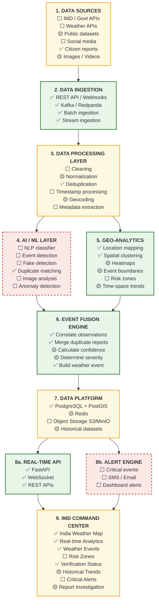
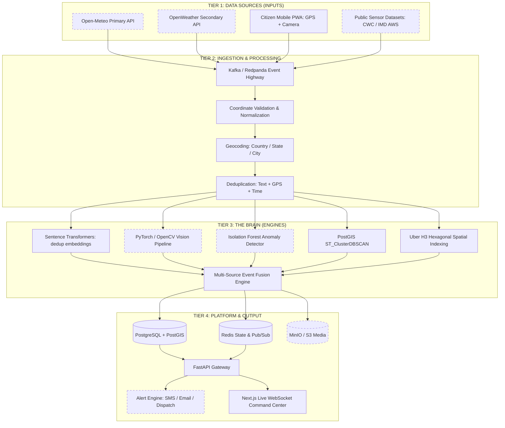

# INDRA Architecture Specification & Engineering Blueprint

**Project Title**: INDRA (Intelligent National Disaster & Weather Platform)  
**Problem Statement ID**: SIH26069 (National Weather Big Data Analytics Platform)  
**Theme**: Disaster Management | **Category**: Software  
**Team**: Sixth Sense — Smart India Hackathon 2026  

> **How to read this document.** This is the **target architecture** — the system INDRA is
> designed to be. Sections 1–8 describe that design and do not change as implementation
> progresses. **Section 0 below is the honest ledger of what is actually built**, and it is
> the section to trust when asking "does this run today?". Keep them separate: the design is
> the pitch, the ledger is the truth, and conflating the two is how a demo falls apart under
> a judge's follow-up question.
>
> Ledger last verified against code: **16 Sep 2026** (end of backend sprint Day 1).

---

## 0. Implementation Status Ledger

Legend: ✅ built and exercised · 🟡 partial — real but incomplete · ⬜ designed, not built

This ledger is organised by the **canonical 9-layer stack** from the team's official
SIH26069 system-architecture diagram. Every other diagram in this repo — including §3's
four-tier engineering view — is a projection of this stack; where they disagree, **this is
the reference.**

Legend: ✅ built · 🟡 partial · ⬜ designed, not built



### Layer-by-layer ledger

| # | Layer | Status | What is actually true |
|---|---|---|---|
| 1 | Data Sources | 🟡 **1 of 6** | Only citizen reports have a live writer (`POST /api/reports/submit`). `TWITTER_IMD`, `AWS_SENSOR`, `CWC_GAUGE`, `OFFICIAL_DISPATCH` are declared `SourceType` enum values with no producer. **There is no HTTP client anywhere in `app/`** — `OPEN_METEO_API_URL`, `OPENWEATHER_API_KEY`, `IMD_API_KEY` and `TWITTER_BEARER_TOKEN` sit unread in `.env`. `raw_reports.media_url` stores a string; no image is uploaded or opened. |
| 2 | Data Ingestion | ✅ **complete** | REST → Postgres **and** Redpanda (`indra.raw.reports`); `workers/report_consumer.py` consumes it. Batch via `scripts/seed_national_data.py` (37 events, ~1,200 reports, 10 cities). The only layer with no gaps. |
| 3 | Data Processing | 🟡 **2 of 6** | Deduplication is real and wired (`services/dedup.py`: MiniLM cosine ≥ 0.88 **AND** ≤ 1 km **AND** ≤ 15 min, Levenshtein ≥ 0.75 fallback). Normalization is coordinate-sanitising only; geocoding is a 56-city static gazetteer, not a resolver. Cleaning, timestamp processing and metadata extraction do not exist — timestamps are `now()` at ingest. **Known defect:** out-of-India coordinates are *snapped to the centroid `(22, 82)`, not rejected*, so two junk reports can manufacture a fake event there. |
| 4 | AI / ML | ⬜ **1 of 6** | `all-MiniLM-L6-v2` runs, but **only for duplicate matching**. No text classifier, so nothing derives event type or severity from report content. No vision model, no fake detection, no anomaly detection — `station_readings.anomaly_score` defaults to `0.0` and is never computed. **This is the weakest layer and the one most likely to be probed.** |
| 5 | Geo-Analytics | ✅ **mostly** | `ST_ClusterDBSCAN` clustering is real, persists membership, and yields centroid / radius / max-pairwise stats in `geography` metres. H3 res-8 cells are computed and stored but nothing reads them yet, so heatmaps are storage-ready, not built. Events carry `center_point` and `impact_radius_km`; `boundary_polygon` exists in the schema but is never populated. Risk zones do not exist. |
| 6 | Event Fusion | ✅ **the spine** | `services/pipeline.py` genuinely correlates, merges duplicates, merges *streaming-arrival fragments* into one event, scores, and persists. Confidence and severity are 🟡 because the arithmetic is real while **4 of 6 scoring factors are placeholders**, and severity is derived from corroboration count rather than content. |
| 7 | Data Platform | 🟡 **1.5 of 4** | PostGIS is fully real (2 migrations, GIST indexes, 6 enums, an audit-immutability trigger verified live). **Redis runs but no backend code connects to it** — WebSocket fan-out is an in-process list, so the app cannot run multi-worker. Object storage is configured in `.env` but absent from `docker-compose.yml`, with no client library installed. |
| 8a | Real-Time API | ✅ **complete** | FastAPI, 7 routers, REST + `/ws/events` carrying `NEW_REPORT`, `VERIFIED_EVENT`, `DEMO_PULSE`. Caveat: **every endpoint is unauthenticated** — the bcrypt/JWT/`require_roles` machinery in `core/security.py` is real, correct, and guards nothing. |
| 8b | Alert Engine | ⬜ **absent** | Not implemented in any form: no notification code, no SMS/email provider, no critical-event trigger. The only `alert` strings in the backend are UI preference fields in `api/profile.py`. |
| 9 | Command Center | 🟡 | The Next.js dashboard is built (frontend team). Backend-side, verification status and events are served from real data; risk zones and critical alerts have no backend behind them. Every frontend fetch falls back to mock data, so **the UI looking complete says nothing about backend state**. |

### Where the real path runs

```
Citizen report ──► REST ──► Redpanda ──► consumer ──► dedup ──► DBSCAN cluster
                                                                      │
   WebSocket ◄── verified_events row ◄── 6-factor receipt ◄── cluster stats
```

Everything on that line is live and test-covered. Everything off it — external feeds, NLP
classification, vision, anomaly detection, alerting, object storage — is not.

### Audit, auth and review — three claims to keep straight

| Claim made elsewhere in this doc | Reality |
|---|---|
| "Unalterable SHA-256 audit trail" | Table, ORM model and a `BEFORE UPDATE OR DELETE` trigger that genuinely rejects mutation all exist and were verified against a live database. **Nothing writes a row.** |
| "Human-in-the-loop review queue" | Events *are* routed to `PENDING_HUMAN_REVIEW` / `QUARANTINED` by real thresholds. **There is no endpoint to act on them** — `api/events.py` is read-only. |
| "RBAC / role-gated access" | Fully implemented in `core/security.py`, **applied to zero endpoints**. |

### The one-line summary

The **spine is real**: a citizen report travels REST → Kafka → dedup → DBSCAN cluster →
weighted scoring → a persisted verified event → WebSocket, and that path is covered by
tests. What is **not** real is most of the *perception* (no NLP classification, no vision,
no anomaly detection), all of the *external ingestion* (no API is polled), and the entire
*alerting* tier. Two of the six confidence factors carry real evidence; four are honest
placeholders that the receipt labels as such.

---

## 1. Core Engineering Philosophy

> **"We are building an intelligence platform, not a weather app."**

Traditional weather apps simply answer: *"What is the weather in Patna?"* (1 API request $\rightarrow$ 1 UI update).  
**INDRA** answers the critical emergency question: **"What weather events are unfolding, how severe are they, how reliable is the data, and what is the underlying verifiable evidence?"**

| Dimension | Standard Weather App | INDRA Intelligence Platform |
| :--- | :--- | :--- |
| **System Paradigm** | Basic CRUD / Proxy to third-party API | Event-Fusion Engine & Emergency Command Center |
| **Data Ingestion** | Synchronous pull on user page load | Asynchronous multi-stream push via Kafka/Redpanda |
| **Data Integrity** | Unvetted, blind trust in external feed | AI Verification, cross-source corroboration, anomaly detection |
| **Output Entity** | Simple weather forecast card (temp, rain %) | Fused **Verified Weather Event** with unalterable evidence trail |
| **Target User** | Individual citizen checking today's rain | NDRF, SDMAs, District Emergency Operations Centers (EOCs) |

---

## 2. Decoupling Confidence from Severity: The 2×2 Matrix

Disaster response requires separating **how dangerous an event is** (Severity) from **how certain we are that it is happening** (Confidence).

```
                      SEVERITY (Low ───────► Critical)
          ▲
          │   ┌─────────────────────────────┬─────────────────────────────┐
          │   │      UNVERIFIED THREAT      │   CRITICAL VERIFIED EVENT   │
          │   │                             │                             │
          │   │  Single report of dam break │  Patna flood (100+ reports) │
H         │   │  ACTION: Immediate Admin    │  ACTION: Immediate Public   │
I  C      │   │          Review Flag        │          & NDRF Alert       │
G  O      │   ├─────────────────────────────┼─────────────────────────────┤
H  N      │   │            NOISE            │    CONFIRMED MINOR EVENT    │
   F      │   │                             │                             │
│  I      │   │  Isolated rumor or tweet    │  Verified localized puddle  │
│  D      │   │  ACTION: Filter & Ignore    │  ACTION: Monitor; no alert  │
▼  E      │   │                             │          dispatch           │
   N      │   └─────────────────────────────┴─────────────────────────────┘
   C
   E
```

- **Critical Verified Event (High Severity, High Confidence)**: Multi-source consensus confirmed. Auto-publishes and triggers instant sirens, SMS broadcast, and NDRF dispatch.
- **Unverified Threat (High Severity, Low Confidence)**: A catastrophic claim (e.g. dam breach or landslide) with only 1 or 2 uncorroborated reports. **Never ignored, never auto-published**—flagged with highest priority in the human review queue.
- **Confirmed Minor Event (Low Severity, High Confidence)**: Confirmed minor waterlogging; logged for urban municipal tracking without inducing public panic.
- **Noise (Low Severity, Low Confidence)**: Filtered out before reaching operators.

---

## 3. The Complete Tiered System Architecture

Solid borders mark what is **built** today; dashed borders mark what is **designed but not
implemented** (see §0 for the detail behind each).



> **Diagram note:** `SRC3` and `OBJ` were both named `S3` in an earlier revision of this
> file, which silently collapsed the Citizen PWA and the object store into a single Mermaid
> node and drew an edge from the fusion engine back into the citizen app. Renamed.

---

## 4. Spatio-Temporal Clustering & Indexing

INDRA processes incoming reports through a 3-step spatial pipeline:

1. **Coordinate Validation**: Validates latitude $[-90, 90]$ and longitude $[-180, 180]$, stripping coordinate jitter and normalizing timestamps to UTC.
2. **Administrative Geocoding**: Resolves coordinates to official administrative boundaries:  
   $$\text{GPS Lat/Lng} \longrightarrow \text{Country: India} \longrightarrow \text{State: Bihar} \longrightarrow \text{District: Patna}$$
3. **Hybrid Spatial Clustering**:
   - **PostGIS `ST_ClusterDBSCAN`**: Identifies dense arbitrary spatial shapes of disaster boundaries (`eps = 5km`, `min_samples = 2`).
   - **Uber H3 (`H3_HEX`)**: Partitions the geographic area into discrete hexagonal cells (Resolution 8, edge length $\approx 460\text{m}$) for high-speed spatial hashing, heatmaps, and spatial indexing.

---

## 5. Explainable Verification: The Verification Receipt

INDRA does **not** treat confidence as a black box. For every generated incident, the system computes and prints an **unalterable Verification Receipt** with exact mathematical weights summing to $100\%$:

$$C = 0.25 \cdot S_{\text{weather}} + 0.20 \cdot S_{\text{reports}} + 0.20 \cdot S_{\text{spatio-temporal}} + 0.15 \cdot S_{\text{image}} + 0.15 \cdot S_{\text{reliability}} + 0.05 \cdot S_{\text{anomaly}}$$

```
┌────────────────────────────────────────────────────────────────────────┐
│                        THE VERIFICATION RECEIPT                        │
│                     CONFIDENCE SCORE: 94 / 100                         │
├────────────────────────────────────────────────────────────────────────┤
│  ✓ Weather Agreement (25%)          : Open-Meteo/AWS recorded 92mm     │
│  ✓ Independent Reports (20%)        : 103 verified independent reports │
│  ✓ Location & Time Consistency (20%): PostGIS & H3 cluster within 0.8km│
│  ✓ Image Evidence (15%)             : PyTorch floodwater prob: 0.91    │
│  ✓ Source Reliability (15%)         : Verified app users & AWS sensors │
│  ✓ Historical Anomaly (5%)          : 140mm vs 35mm seasonal baseline   │
└────────────────────────────────────────────────────────────────────────┘
```

> **Status (see §0):** the weighted arithmetic, the quadrant assignment, and the
> review-status routing are all real and unit-tested. The receipt above is the *designed*
> output. **Today only two of the six factors carry real evidence** — `report_density` (the
> actual deduplicated report count in the cluster) and `spatial_coherence` (the actual
> DBSCAN cluster tightness). The other four are placeholders, and each receipt carries a
> `provenance` field marking every factor as `"computed"`, `"offline"`, or
> `"heuristic_placeholder"` so the distinction survives into the API response rather than
> living only in this document. A factor passed as `None` scores `0.0` with the evidence
> string `"Telemetry factor offline"` — **stating that a signal is absent is preferred over
> inventing a number for it.**

### Duplicate Merging Engine
Reports are grouped and merged before fusion using the composite duplicate rule:
$$\text{Duplicate if: } [\text{Cosine Similarity} \ge 0.88] + [\Delta \text{GPS} \le 1.0\text{ km}] + [\Delta t \le 15\text{ mins}]$$

All three gates are ANDed, and all three are live in `services/dedup.py`. Two caveats worth
knowing: the cosine threshold of **0.88 is strict enough to miss paraphrases** (measured:
same-event paraphrase 0.815, genuinely distinct reports 0.519, unrelated text 0.136 — so
~0.75–0.80 is the separating band), and if the embedding model cannot load, the service
degrades to a normalized Levenshtein ratio at ≥ 0.75 rather than failing.

### Event merging across streaming arrivals

Reports arrive one at a time, so a cluster crosses `min_samples` long before the last
report about an incident has landed. Without a merge step, reports 1–2 create one event and
reports 3–5 create a rival event a few hundred metres away — the platform reproducing the
exact fragmentation it exists to remove. `pipeline.py` therefore folds a new cluster into a
recent overlapping event (within its impact radius plus one DBSCAN `eps`, inside a 2-hour
window, excluding `REJECTED` events) and re-scores it, instead of creating a competitor.

---

## 6. Human-in-the-Loop Review & Unalterable Audit Trails

To guarantee accountability, every human intervention is recorded with an immutable SHA-256 hash in PostgreSQL:

- **$\mathbf{\ge 90\%}$**: Automatically Verified & Published to Command Center.
- **$\mathbf{70\% - 90\%}$ (Probable)**: Flagged for Emergency Analyst review.
- **$\mathbf{< 70\%}$ (Suspicious)**: Retained in quarantine buffer. If severity is Critical, escalated to Emergency Review.

> These are the real figures — `AUTO_PUBLISH_THRESHOLD=0.90` and `HUMAN_REVIEW_THRESHOLD=0.70`
> in `.env`, applied by `fusion_engine.determine_review_status()`. Earlier revisions of this
> document and the README quoted a 60% lower bound, which never matched the code.

> **Status (see §0):** the `audit_logs` table, its ORM model, and a `BEFORE UPDATE OR DELETE`
> trigger that genuinely rejects mutation all exist and were verified against a live
> database. **No code writes an audit row yet**, and there is no human-review endpoint to
> trigger one — `api/events.py` is read-only. The thresholds above *are* enforced: every
> event gets a `review_status` from them. What is missing is the human half of
> human-in-the-loop, and the hash chain that would record it.

```
+-------------------------------------------------------------------------------+
| AUDIT LOG OUTPUT:                                                             |
| Admin A | 15:42 | Verified EVENT-28231827-A | Reason: AWS + citizen evidence |
| Hash: e3b0c44298fc1c149afbf4c8996fb92427ae41e4649b934ca495991b7852b855       |
+-------------------------------------------------------------------------------+
```

---

## 7. Deployment Strategy: Modular Monolith

Rather than introducing 15 fragile microservices during an active hackathon sprint, INDRA follows a **Modular Monolith** pattern:
- **FastAPI Monolith**: Serves Auth, Citizen PWA APIs, Weather Ingestion, Alert Queries, and WebSocket feeds.
- **AI Worker Process**: Runs NLP embeddings, OpenCV computer vision, and DBSCAN clustering.
- **Redpanda / Kafka Buffer**: Absorbs sudden mass-reporting traffic surges (e.g. 10,000 simultaneous reports) and feeds them to workers at a controlled rate without dropping packets.
- **Infrastructure**: Single `docker compose up` orchestrating PostGIS, Redis, Redpanda, and MinIO.

> **Status (see §0):** three deviations from the above, all deliberate.
>
> 1. **There is no separate AI worker process.** `workers/report_consumer.py` runs as an
>    `asyncio` task inside the FastAPI process, started from the app's lifespan hook. The
>    embedding model and the pipeline therefore share the API's event loop. This is fine at
>    demo scale and is the right call for a hackathon, but it means CPU-heavy scoring can
>    stall request handling, and it is the first thing to split out if load becomes real.
> 2. **`docker compose` brings up three services, not four** — PostGIS, Redis, Redpanda.
>    MinIO is not in the file. Adding it is an infra decision for the team, not a backend
>    one.
> 3. **Redis is started but unused.** No backend code opens a Redis connection. Because
>    WebSocket fan-out is an in-process list rather than Redis pub/sub, **the backend cannot
>    currently be run with more than one worker** without clients silently missing events.
>    Run it single-process until that changes.

---

## 8. The 10-Scene Hackathon Demonstration Sequence

1. **Scene 1 (Baseline)**: India map displays normal operational telemetry with live Open-Meteo feeds.
2. **Scene 3 (The Spike)**: `scripts/run_patna_demo.py` simulates a cloudburst surge—127 reports enter via Kafka in seconds.
3. **Scene 5 (Fusion)**: Duplicate detection collapses 127 reports into 1 major flood event; PostGIS binds coordinates to Central Patna.
4. **Scene 7 (Evidence)**: OpenCV confirms waist-deep water; Open-Meteo confirms 92mm rainfall anomaly.
5. **Scene 8 (Intelligence)**: INDRA outputs the 94% Verification Receipt and tags the event as `Critical Verified Event`.
6. **Scene 10 (Action)**: WebSocket pushes incident polygon to the Next.js dashboard; emergency broadcast alert is triggered.

### What each scene actually does today

This matters more than any other status note in this document, because it is the part a
judge watches happen. **Know which scenes are live and which are narration.**

| Scene | Today |
|---|---|
| 1 — Baseline | 🟡 The map and telemetry render, but from seeded/mock data. **No Open-Meteo feed is live**; nothing polls it. |
| 3 — The Spike | 🟡 `run_patna_demo.py` prints the narrative and replays `patna_flood_scenario.json`. The **live** surge path is `POST /api/reports/submit` → Kafka, which does work and is the one to demo. |
| 5 — Fusion | ✅ **Real.** Dedup + `ST_ClusterDBSCAN` + event merging genuinely collapse many reports into one event with one `event_code`. This is the strongest scene and the honest centre of the pitch. |
| 7 — Evidence | ⬜ **Narration.** There is no OpenCV, and no Open-Meteo call. The receipt marks both factors as placeholders. Do not claim this scene live. |
| 8 — Intelligence | 🟡 **Real receipt, partly real inputs.** The 6-factor breakdown is genuinely computed and displayed; two factors carry evidence, four are placeholders that the receipt labels. The "94%" is illustrative — the live number is whatever the inputs produce. |
| 10 — Action | 🟡 WebSocket push to the dashboard is **real** (`VERIFIED_EVENT`). The emergency broadcast / NDRF dispatch is **not implemented** — there is no alert engine. |

The defensible version of this demo is: *submit a report live, watch several reports
collapse into one verified event, open the receipt, and point at which factors are real and
which say "Telemetry factor offline."* That story is entirely true, and it survives
follow-up questions. The version that claims Scenes 7 and 10 end-to-end does not.
