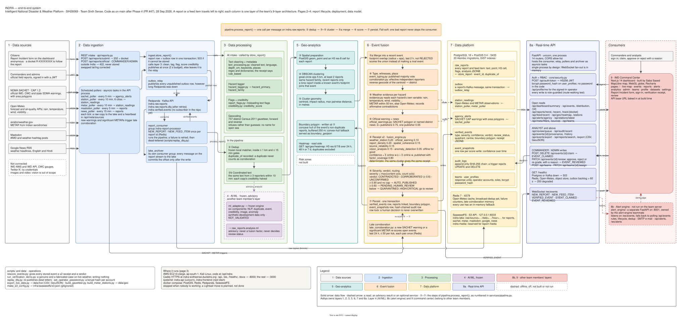
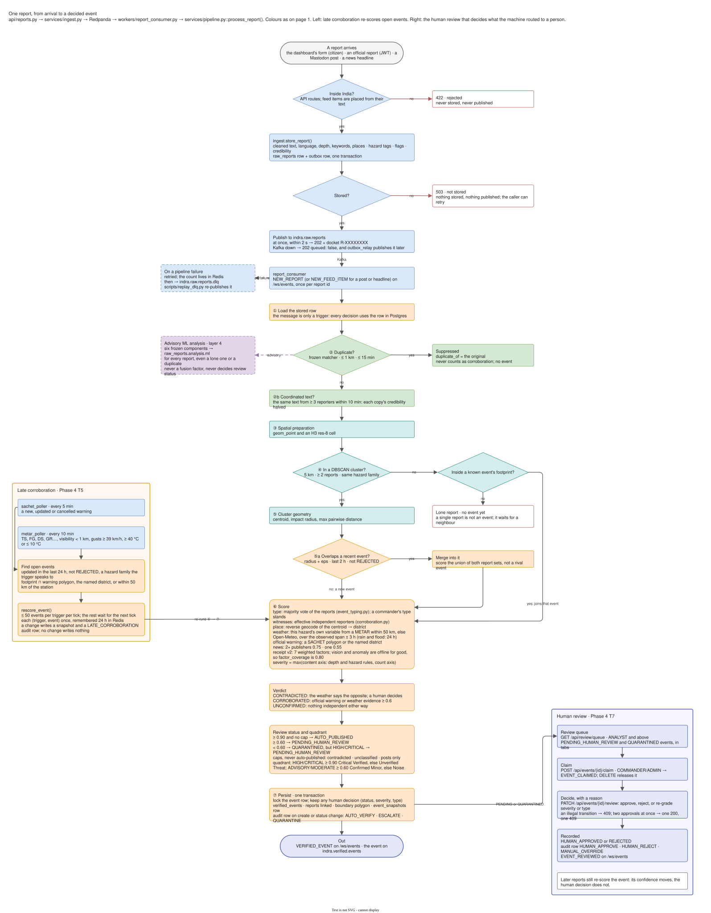
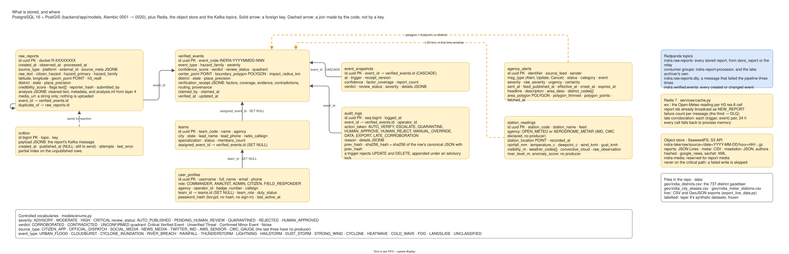
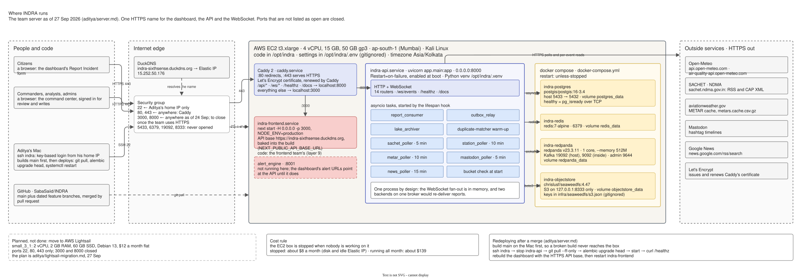

# INDRA — System Architecture

| | |
|---|---|
| **System** | INDRA, the Intelligent National Disaster & Weather Platform (SIH26069, Team Sixth Sense) |
| **Applies to** | `main` after Phase 4 ([PR #47](https://github.com/SabaSaiid/INDRA/pull/47)), migration head `0020_verification_v2` |
| **Last reviewed** | 28 Sep 2026, against the code |
| **Diagrams** | [`architecture/indra-system-architecture.drawio`](architecture/indra-system-architecture.drawio): four pages, exported beside it as SVG |
| **Companion documents** | [Backend architecture](backend-architecture.md) (module-level detail) · [API contract](api-contract.md) · [Bug register](bug-register.md) |

This document describes the system as it is built: its context, structure, data flow,
verification model, data model, deployment, quality attributes and the decisions behind them. If
this document and the code disagree, the code is authoritative and this document has a defect.

---

## 1. Context

### 1.1 Problem

During an acute weather event, emergency operations centres receive a flood of uncoordinated
signals: citizen reports, official warnings, automated observations, social posts and news
headlines. Many describe the same incident. Some are duplicates, some are stale and some are false.
The problem statement asks for a scalable platform that ingests these signals from many sources,
processes and stores them, classifies weather events, detects misleading information, removes
duplicates and presents the result in real time to administrators.

### 1.2 What INDRA produces

INDRA turns that input into a **verified weather event**: one record per real-world incident, with

- a hazard type (16 types in 4 families), a location, a district and a **boundary polygon**;
- a **severity**, graded on the hazard's own published scale;
- a **confidence score** with its **factor coverage**, a **verdict** (`CORROBORATED`,
  `CONTRADICTED` or `UNCONFIRMED`) and a routing decision;
- a **Verification Receipt** listing every factor, its evidence, its score and its weight;
- a **provenance** trail: its contributing reports and a hash-chained audit row for every machine
  and human decision.

### 1.3 Users

| User | Needs |
|---|---|
| Commanders (district EOC, SDMA) | A short queue of events worth acting on, the evidence for each, and the authority to approve, reject or re-grade |
| Analysts | Search, export and history across reports and events, and the audit ledger |
| Citizens | A way to report what they see, and a docket number to follow that report |
| Integrators | A stable REST and WebSocket contract, and Kafka topics |

### 1.4 Goals and non-goals

**Goals:** no report lost once accepted; one event per incident, never one per report;
explainable, deterministic scoring; human authority over publication; a tamper-evident record of
every decision; graceful degradation when a non-critical dependency fails.

**Non-goals:** weather forecasting (INDRA consumes observations and forecasts, it does not produce
them); dispatching public alerts from the core platform (the separate alert engine, layer 8b, owns
that); using image or anomaly evidence in the confidence score.

---

## 2. System overview



*Figure 1. End-to-end system. Each column is one layer; ②–⑦ are the steps of
`pipeline.process_report()`. Source: page 1 of the draw.io file.*

INDRA is a **modular monolith**. One FastAPI process serves REST and WebSocket traffic and
supervises every background worker as an asyncio task: the Kafka report consumer, the outbox relay,
the lake archiver and five feed pollers. PostgreSQL + PostGIS is the system of record. Redpanda
carries the report stream. Redis holds caches and short-lived memory. An S3-compatible object store
(SeaweedFS) holds the raw data lake.

### 2.1 Layers and their state

| # | Layer | State | What is built |
|:-:|---|---|---|
| 1 | **Data sources** | Built | Citizen reports (anonymous REST) and official field reports (authenticated). NDMA SACHET CAP warnings from IMD, CWC and SDMAs every 5 min. Open-Meteo 24 h precipitation for six cities every 10 min, plus per-event hourly weather. METAR from Indian aerodromes every 10 min. Mastodon weather-hashtag posts every 5 min. Google News headlines in English and Hindi every 15 min. None needs a key. **Not connected:** the IMD API (IP whitelisting), CWC gauges, Twitter/X |
| 2 | **Ingestion** | Built | A report and its Kafka message are written in one transaction (outbox), then published at once or by the relay within seconds. Topic `indra.raw.reports`. Three failed attempts go to `indra.raw.reports.dlq`, which `scripts/replay_dlq.py` replays. A second consumer group archives every message to the lake. Batch input arrives through the scheduled pollers. There is no bulk import endpoint yet (Phase 6) |
| 3 | **Processing** | Built | India-bounds validation (outside → `422`, never stored). A swapped lat/lng is corrected. Forward and reverse geocoding over a 737-district Census 2011 gazetteer, which refuses rather than guesses. H3 res-8 cell. Rule-based cleaning and metadata extraction (language, depth, temperature, rainfall, wind, visibility, places). A hazard tagger for English, Hindi and Hinglish with negation and tense handling. Misleading-text flags and coordinated-text detection. A credibility score. Deduplication |
| 4 | **AI/ML** | Advisory | Six frozen local synthetic-development components (NLP, duplicate matching, event grouping, credibility, image, anomaly) write typed advisory results to `raw_reports.analysis.ml`. They never enter the fusion score or decide a status. The owner's documents: [ML architecture](ML_ARCHITECTURE.md) |
| 5 | **Geo-analytics** | Built (risk zones: not built) | Great-circle DBSCAN per hazard family. Cluster geometry in metres. A concave-hull boundary polygon, buffered 250 m, on every event. An H3 heatmap at resolutions 6, 7 and 8 over 24 h, 48 h or 7 d, with duplicates excluded |
| 6 | **Event fusion** | Built | Merge into recent events, typing by majority vote, effective independent witnesses, per-hazard weather evidence, the official-warning factor, receipt v2, verdicts, hazard-specific severity, routing with caps, and late corroboration |
| 7 | **Data platform** | Built | PostgreSQL 16 + PostGIS 3.4 with 20 migrations. A SHA-256 audit chain guarded by a trigger. Event snapshots. Redis for caches and dedup memory, never load-bearing. A SeaweedFS lake of raw messages and poller payloads. Historical exports to CSV and GeoJSON |
| 8a | **Real-time API** | Built | 14 routers under `/api`, `WS /ws/events`, `/healthz`. JWT authentication backed by bcrypt accounts, RBAC on every write, a review queue with 15-minute claims, event history, provenance and the audit ledger |
| 8b | **Alert engine** | Separate service | [`alert_engine/`](../alert_engine/), a standalone FastAPI service on port 8001 with its own rules and SMTP delivery, maintained by its owner. It is not run in the reference deployment, and the core platform issues no alerts. `GET /api/alerts/agency` serves **official** warnings collected from SACHET. See [Alert engine integration](ALERT_ENGINE_INTEGRATION.md) |
| 9 | **Command center** | Built | Next.js 14 dashboard in [`frontend/`](../frontend/): live map, events, reports, review, alerts page, analytics, admin, teams, profile, 12-language UI |

---

## 3. Data flow



*Figure 2. The lifecycle of one report. Source: page 2 of the draw.io file.*

### 3.1 Intake (`services/ingest.py`)

`POST /api/reports/submit` (citizen, anonymous) or `POST /api/reports/official` (COMMANDER/ADMIN)
validates the body, geocodes the point, assigns the H3 cell, extracts metadata, tags hazards and
flags, and scores credibility. It then writes the `raw_reports` row and its `outbox` message in
**one transaction**. The response is `202` with a docket number. If Kafka is unavailable, the
report is still stored (`queued: false, will_retry: true`) and the relay publishes it when the
broker returns. If the database write fails, the answer is `503` and nothing is stored or
published. Pollers use the same `store_report()` path for posts and headlines.

### 3.2 The pipeline (`services/pipeline.py :: process_report`)

The report consumer (`indra-report-processor` group) calls the pipeline once per message. It
broadcasts `NEW_REPORT` (or `NEW_FEED_ITEM`) once per report id, with the memory kept in Redis so
it survives a restart. It fails soft: one bad report is retried, then dead-lettered, and never
stops the loop.

| Step | What happens |
|---|---|
| ② Dedup | The frozen local matcher, gated by ≤ 1 km and ≤ 15 min. A duplicate is recorded as `duplicate_of`, never clusters and never counts as corroboration |
| ②b Coordinated text | The same text from ≥ 3 reporters within 10 min halves each copy's credibility |
| ③ Spatial preparation | PostGIS point and H3 res-8 cell |
| ④ Clustering | DBSCAN over recent reports of the same **hazard family**, with a great-circle radius and at least 2 reports. A lone report inside a known event's footprint joins that event |
| ⑤ Geometry | Centroid, impact radius and maximum pairwise distance, in metres |
| ⑤a Merge | A new cluster overlapping a recent event (its radius plus the family radius, within 2 h, not `REJECTED`) is folded into that event and re-scored, rather than creating a rival event |
| ⑥ Type, witnesses, place | Type by majority vote of the reports' hazards, with ties broken by precedence and no votes giving `UNCLASSIFIED`. A commander's type override stands. **Effective independent reporters** (`n_eff`): one publisher counts once and coordinated copies are discounted. The district comes from a reverse geocode of the centroid |
| ⑥ Evidence | Weather for the hazard's own variable: an airport METAR within 50 km first, otherwise Open-Meteo, with floods on 24 h rainfall. Official warnings in force that cover the event. News counted by distinct publisher |
| ⑥ Score | Receipt v2, verdict, severity and routing (§4) |
| ⑦ Persist | **One transaction:** the `verified_events` row, report links, boundary polygon, snapshot and hash-chained audit row. A row lock ensures a human decision is never overwritten. Then `VERIFIED_EVENT` goes over the WebSocket and to `indra.verified.events` |

### 3.3 Human review

The review queue (`GET /api/review/queue`) offers `pending`, `contradicted`, `suspicious`,
`high_impact` and `recent` tabs. A commander **claims** an event for 15 minutes (`EVENT_CLAIMED`),
then approves, rejects or re-grades it with a reason (`PATCH /api/events/{id}/review`). The result
is `HUMAN_APPROVED` or `REJECTED`, an audit row and `EVENT_REVIEWED` over the WebSocket. Illegal
transitions return `409`. Of two concurrent approvals, exactly one succeeds. An approval survives
later merges and re-scores.

### 3.4 Late corroboration

When the SACHET poller stores a new warning, or the METAR poller a significant observation, open
events from the last 24 h that it could affect are re-scored (steps ⑥ → ⑦). The run is limited to
50 per tick, and each event–evidence pair is evaluated once (tracked in Redis). A change writes a
`LATE_CORROBORATION` ledger row with `{trigger, before, after}` and a snapshot.

---

## 4. Verification model

### 4.1 The receipt

```
confidence      = Σ_online (weight × score) / Σ_online weight
factor_coverage = Σ_online weight
```

| Factor | Weight | Evidence | State |
|---|:-:|---|---|
| Weather station corroboration | 0.20 | Hazard-specific variable: METAR ≤ 50 km, else Open-Meteo; affirmative contradictions recorded | Online unless neither source answers |
| Official warning | 0.10 | SACHET warnings in force, of the event's hazard, whose polygon or district covers the event | Online while SACHET was polled in the last 30 min |
| Report density | 0.20 | Effective independent reporters, saturating at 25 | Online |
| Spatial coherence | 0.15 | Raised cosine over the cluster span against twice the family radius | Online |
| Computer vision | 0.15 | — | **Offline**: image analysis is not in the scoring path |
| Source reliability | 0.15 | Documented per-source prior, maximum over the cluster. News scores 0.75 from ≥ 2 publishers and 0.55 from one | Online |
| Anomaly detection | 0.05 | — | **Offline**: anomaly detection is not in the scoring path |

An offline factor lowers the stated coverage and does not silently score zero. With vision and
anomaly permanently offline, coverage is **0.80** and is quoted with every score. Every factor in
the receipt carries its provenance (`computed`, `offline` with a reason, `rule_based_…`,
`human_override`), its evidence lines and its source. The same inputs produce a byte-identical
receipt, and a test pins this.

### 4.2 Verdict, routing and caps

| Verdict | Rule |
|---|---|
| `CONTRADICTED` | The measured weather affirmatively contradicts the claim, per the published contradiction table in `services/evidence.py`. Missing data never contradicts |
| `CORROBORATED` | There is no contradiction, and the official warning or the weather scores ≥ 0.6 |
| `UNCONFIRMED` | Otherwise |

| Confidence | Routing |
|---|---|
| ≥ 0.90 | `AUTO_PUBLISHED` |
| ≥ 0.60 | `PENDING_HUMAN_REVIEW` |
| < 0.60 | `QUARANTINED`, or `PENDING_HUMAN_REVIEW` if severity is `HIGH` or `CRITICAL` (`routing.basis = severity`) |

**Caps** (`fusion_engine.review_caps`) turn `AUTO_PUBLISHED` into `PENDING_HUMAN_REVIEW` when an
event is `contradicted`, `unclassified` or `posts_only`. A contradicted event is never
auto-rejected. In practice, reaching 0.90 needs heavy measured rain, many tight independent reports,
an official warning and a trusted source at once, so most events reach the command center through
review. That is the intended operating mode.

### 4.3 Severity and confidence are independent

Severity (how bad) and confidence (how sure) are computed separately, and both drive routing:

|  | Low confidence | High confidence |
|---|---|---|
| **High severity** | *Unverified threat.* Always goes to human review, never quarantined | *Critical verified event.* Published after review or at ≥ 0.90 |
| **Low severity** | *Noise.* Quarantined, visible on request | *Confirmed minor event.* Published and monitored |

Severity is `max(content axis, corroboration axis)`. The content axis uses the hazard family's own
measure: depth or 24 h rain on IMD's categories for water, IMD heat and cold-wave criteria for
thermal, IMD fog classes for visibility, and Beaufort wind for convective. Impact words set a floor
(`stranded` → HIGH, `drowned` → CRITICAL). The corroboration axis (≥ 5 reports MODERATE, ≥ 10
HIGH) never reaches CRITICAL. The thresholds and their sources are in
[`services/severity_rules.py`](../backend/app/services/severity_rules.py).

---

## 5. Geospatial model

| Hazard family | Event types | Radius | Window |
|---|---|:-:|:-:|
| Water | cloudburst, storm surge, flood, river flood, landslide, heavy rainfall | 5 km | 6 h |
| Convective | cyclone, dust storm, lightning, hailstorm, thunderstorm, strong winds | 10 km | 3 h |
| Thermal | heatwave, cold wave | 25 km | 24 h |
| Visibility | fog | 15 km | 12 h |

Only reports of one family cluster together: a flood report and a rain report can form one event,
but a flood report and a fog report cannot. When reports in a cluster disagree, the event is named
by precedence, with the impact outranking its cause (a flood beats the rain that caused it).
Clustering is local and time-limited (`cluster_around`). With 10,000 historical reports in the
table it measured 7.2 ms, against 296 ms for the earlier whole-table approach.

DBSCAN uses scikit-learn's haversine metric off the event loop, so the radius is a true circle at
every latitude. H3 res 8 (≈ 460 m edge) indexes every report, and the heatmap aggregates to res 7
and res 6, with each parent's count equal to the sum of its children.

---

## 6. Data model



*Figure 3. Tables, topics and files. Source: page 4 of the draw.io file.*

| Store | Holds | Criticality |
|---|---|---|
| **PostgreSQL + PostGIS** | `raw_reports`, `verified_events`, `event_snapshots`, `station_readings`, `agency_alerts`, `audit_logs`, `outbox`, `teams`, `user_profiles` (also the sign-in accounts) | Critical: without it, submit, sign-in and `/healthz` return `503` |
| **Redpanda** | `indra.raw.reports`, `indra.raw.reports.dlq`, `indra.verified.events` | Critical but not lossy: reports wait in the outbox |
| **Redis** | Open-Meteo cache, broadcast-dedup set, filter-options cache, failure counters, late-corroboration memory | Non-critical: each use falls back to process memory |
| **SeaweedFS (S3)** | `indra-lake`: every report-stream message and every poller's raw payload, as gzipped JSON Lines under `raw/source=…/date=…/hour=…`. `indra-media` is reserved for Phase 5 | Non-critical: the archiver stays off, and Kafka offsets are committed only after a successful write |
| **Repository `data/`** | District gazetteer, city aliases, Indian METAR stations, recorded demo inputs, layer 4's labelled sets | Read at startup |

`audit_logs` is one global chain ordered by `seq`:
`sha256(canonical_json{prev_hash, event_id, operator_id, action, reason, details, logged_at})`,
with a genesis of `"0" × 64`. It is appended under `pg_advisory_xact_lock` inside the caller's
transaction, and a `BEFORE UPDATE OR DELETE` trigger rejects mutation. The actions are
`AUTO_VERIFY`, `ESCALATE`, `QUARANTINE`, `HUMAN_APPROVE`, `HUMAN_REJECT`, `MANUAL_OVERRIDE`,
`DATA_EXPORT` and `LATE_CORROBORATION`. The pipeline writes decisions, not traffic: one row on
create and one on each status-changing merge.

---

## 7. Deployment



*Figure 4. The reference deployment. Source: page 3 of the draw.io file.*

The reference deployment is one Linux host in AWS `ap-south-1`. Caddy 2 terminates TLS with a Let's
Encrypt certificate. It routes `/api/*`, `/ws/*`, `/healthz` and `/docs` to Uvicorn on `:8000`, and
everything else to the Next.js server on `:3000`. Both run as systemd services. PostGIS, Redis,
Redpanda and SeaweedFS run under Docker Compose, and their ports are never opened to the internet.
A release is `git pull`, `alembic upgrade head` and a service restart. After the upgrade to `0020`,
`scripts/rescore_events.py`, which is idempotent, gives stored events a v2 receipt.

**Process model.** Exactly one backend process runs. WebSocket fan-out is an in-process list,
pollers have no leader election, and two consumers on one broker would re-deliver reports. The
browser-test backend (`ENVIRONMENT=e2e`) is the only sanctioned second process. It refuses to
start unless its database, topics and consumer group are all E2E-scoped.

---

## 8. Quality attributes

| Attribute | How it is achieved | Evidence |
|---|---|---|
| **Durability** | Transactional outbox, DLQ after 3 attempts, lake offsets committed after the write | Redpanda-down drill: 10 of 10 reports kept and published 1.0 s after restart. Object-store-down drill: 12 of 12 messages kept |
| **Correctness** | Deterministic pipeline, idempotent re-scoring, one transaction per event write | Determinism test on the receipt. `rescore_events.py` changed nothing on repeat runs. Migration `0020` run up/down/up on a copy of the team database |
| **Explainability** | Every factor, evidence line, source and routing basis is in the receipt | `GET /api/events/{id}`, `/provenance`, `/history` |
| **Auditability** | Hash-chained, trigger-guarded ledger, with a chain check on read | `GET /api/audit/recent` verifies the whole chain |
| **Security** | bcrypt accounts, JWT, RBAC on every write, production refuses a weak `SECRET_KEY`, explicit CORS, HMAC reporter pseudonyms | `tests/test_mutation_auth.py` walks every route |
| **Availability** | Non-critical dependencies degrade rather than fail | `/healthz`: `healthy`, `degraded` (Redis, Open-Meteo, object store, outbox lag > 60 s) or `unhealthy` (Postgres or Kafka) |
| **Observability** | Per-feed heartbeats and 24 h counts, dependency health, structured warnings on every empty or unavailable read | `GET /api/meta/sources`, `/healthz` |
| **Language coverage** | Rule-based hazard tagger for English, Hindi and Hinglish | Held-out fixture macro-F1 0.9952. On 100 independent real posts, micro-F1 0.913 (Hindi 0.914) |

---

## 9. Architecture decisions

| Decision | Rationale | Trade-off |
|---|---|---|
| **Modular monolith** rather than microservices | One deployable unit and one transaction boundary, with a small operational surface for a small team | One process, so workers share the API's event loop. CPU-heavy work runs in threads. Scaling out needs the changes in §10 |
| **Redpanda** as the Kafka broker | Kafka API compatibility in a single binary with low memory | Single-node broker in the reference deployment |
| **Transactional outbox** | A report can never be accepted and then lost to a broker outage | Up to 2 s of relay latency during an outage |
| **Rule-based, published scoring** rather than a learned score | Every number can be traced and argued with. Deterministic, and it needs no training data | Thresholds are fixed by policy (IMD categories, Beaufort, operational depth cuts), not tuned |
| **Re-normalised confidence with published coverage** | An unavailable signal lowers the stated coverage and does not drag the score to zero or get invented | The score must always be quoted with its coverage |
| **Never auto-reject** | A contradiction or a thin cluster may still be real, so a person decides | Commanders see more events than a stricter gate would pass |
| **SACHET as the route to IMD/CWC warnings** | Public CAP feed, no key. The IMD API requires IP whitelisting | Warnings, not raw sensor data |
| **METAR preferred over the model** | A measured observation outranks a modelled value | Coverage limited to about 110 aerodromes. The model fills the gaps |
| **SeaweedFS** for object storage | S3 API in one container. MinIO's image distribution changed | Any S3 store can replace it through configuration |
| **Great-circle DBSCAN per hazard family** | Physically meaningful radii and windows per hazard, correct at every latitude | Per-family parameters to maintain in `services/hazards.py` |

---

## 10. Limitations and future work

| Area | Current limit | Direction |
|---|---|---|
| Perception | Vision and anomaly factors are offline. Layer 4's components are advisory and `NOT_VALIDATED` for production | Owned by layer 4 |
| Scale-out | Single backend process | Redis pub/sub for WebSocket fan-out, leader election for pollers, separate worker processes |
| Audit tail | Tail truncation or `TRUNCATE` still yields a valid chain | Anchor the head hash externally |
| Anonymous witnesses | Two people who use nearly the same words within 1 km and 15 min can be merged as duplicates | Needs a reporter identity the anonymous channel does not have |
| Authentication | Password only, no MFA | MFA for operator accounts |
| Media | `media_url` is stored but not uploaded or opened | Phase 5: upload to `indra-media`, citizen withdrawal, per-source credibility administration |
| Analytics and bulk ingest | Not built | Phase 6: analytics endpoints, `POST /api/ingest/batch`, load testing on an isolated backend |
| Risk zones | Not built | Not scheduled |

The complete defect history is in [`bug-register.md`](bug-register.md).
