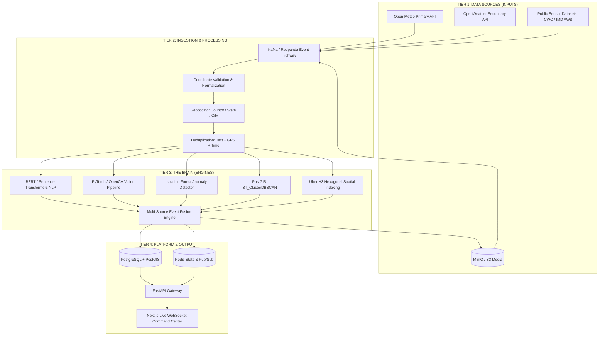

# INDRA Architecture Specification & Engineering Blueprint

**Project Title**: INDRA (Intelligent National Disaster & Weather Platform)  
**Problem Statement ID**: SIH26069 (National Weather Big Data Analytics Platform)  
**Theme**: Disaster Management | **Category**: Software  
**Team**: Sixth Sense — Smart India Hackathon 2026  

---

## 1. Core Engineering Philosophy

> **"We are building an intelligence platform, not a weather app."**

Traditional weather apps simply answer: *"What is the weather in Patna?"* (1 API request $\rightarrow$ 1 UI update).  
**INDRA** answers the critical emergency question: **"What weather events are unfolding, how severe are they, how reliable is the data, and what is the underlying verifiable evidence?"**

| Dimension | Standard Weather App | INDRA Intelligence Platform |
| :--- | :--- | :--- |
| **System Paradigm** | Basic CRUD / Proxy to third-party API | Event-Fusion Engine & Emergency Command Center |
| **Data Ingestion** | Synchronous pull on user page load | Asynchronous multi-stream push via Kafka/Redpanda |
| **Data Integrity** | Unvetted, blind trust in external feed | AI Verification, cross-source corroboration, anomaly detection |
| **Output Entity** | Simple weather forecast card (temp, rain %) | Fused **Verified Weather Event** with unalterable evidence trail |
| **Target User** | Individual citizen checking today's rain | NDRF, SDMAs, District Emergency Operations Centers (EOCs) |

---

## 2. Decoupling Confidence from Severity: The 2×2 Matrix

Disaster response requires separating **how dangerous an event is** (Severity) from **how certain we are that it is happening** (Confidence).

```
                      SEVERITY (Low ───────► Critical)
          ▲
          │   ┌─────────────────────────────┬─────────────────────────────┐
          │   │      UNVERIFIED THREAT      │   CRITICAL VERIFIED EVENT   │
          │   │                             │                             │
          │   │  Single report of dam break │  Patna flood (100+ reports) │
H         │   │  ACTION: Immediate Admin    │  ACTION: Immediate Public   │
I  C      │   │          Review Flag        │          & NDRF Alert       │
G  O      │   ├─────────────────────────────┼─────────────────────────────┤
H  N      │   │            NOISE            │    CONFIRMED MINOR EVENT    │
   F      │   │                             │                             │
│  I      │   │  Isolated rumor or tweet    │  Verified localized puddle  │
│  D      │   │  ACTION: Filter & Ignore    │  ACTION: Monitor; no alert  │
▼  E      │   │                             │          dispatch           │
   N      │   └─────────────────────────────┴─────────────────────────────┘
   C
   E
```

- **Critical Verified Event (High Severity, High Confidence)**: Multi-source consensus confirmed. Auto-publishes and triggers instant sirens, SMS broadcast, and NDRF dispatch.
- **Unverified Threat (High Severity, Low Confidence)**: A catastrophic claim (e.g. dam breach or landslide) with only 1 or 2 uncorroborated reports. **Never ignored, never auto-published**—flagged with highest priority in the human review queue.
- **Confirmed Minor Event (Low Severity, High Confidence)**: Confirmed minor waterlogging; logged for urban municipal tracking without inducing public panic.
- **Noise (Low Severity, Low Confidence)**: Filtered out before reaching operators.

---

## 3. The Complete Tiered System Architecture



---

## 4. Spatio-Temporal Clustering & Indexing

INDRA processes incoming reports through a 3-step spatial pipeline:

1. **Coordinate Validation**: Validates latitude $[-90, 90]$ and longitude $[-180, 180]$, stripping coordinate jitter and normalizing timestamps to UTC.
2. **Administrative Geocoding**: Resolves coordinates to official administrative boundaries:  
   $$\text{GPS Lat/Lng} \longrightarrow \text{Country: India} \longrightarrow \text{State: Bihar} \longrightarrow \text{District: Patna}$$
3. **Hybrid Spatial Clustering**:
   - **PostGIS `ST_ClusterDBSCAN`**: Identifies dense arbitrary spatial shapes of disaster boundaries (`eps = 5km`, `min_samples = 2`).
   - **Uber H3 (`H3_HEX`)**: Partitions the geographic area into discrete hexagonal cells (Resolution 8, edge length $\approx 460\text{m}$) for high-speed spatial hashing, heatmaps, and spatial indexing.

---

## 5. Explainable Verification: The Verification Receipt

INDRA does **not** treat confidence as a black box. For every generated incident, the system computes and prints an **unalterable Verification Receipt** with exact mathematical weights summing to $100\%$:

$$C = 0.25 \cdot S_{\text{weather}} + 0.20 \cdot S_{\text{reports}} + 0.20 \cdot S_{\text{spatio-temporal}} + 0.15 \cdot S_{\text{image}} + 0.15 \cdot S_{\text{reliability}} + 0.05 \cdot S_{\text{anomaly}}$$

```
┌────────────────────────────────────────────────────────────────────────┐
│                        THE VERIFICATION RECEIPT                        │
│                     CONFIDENCE SCORE: 94 / 100                         │
├────────────────────────────────────────────────────────────────────────┤
│  ✓ Weather Agreement (25%)          : Open-Meteo/AWS recorded 92mm     │
│  ✓ Independent Reports (20%)        : 103 verified independent reports │
│  ✓ Location & Time Consistency (20%): PostGIS & H3 cluster within 0.8km│
│  ✓ Image Evidence (15%)             : PyTorch floodwater prob: 0.91    │
│  ✓ Source Reliability (15%)         : Verified app users & AWS sensors │
│  ✓ Historical Anomaly (5%)          : 140mm vs 35mm seasonal baseline   │
└────────────────────────────────────────────────────────────────────────┘
```

### Duplicate Merging Engine
Reports are grouped and merged before fusion using the composite duplicate rule:
$$\text{Duplicate if: } [\text{Cosine Similarity} \ge 0.88] + [\Delta \text{GPS} \le 1.0\text{ km}] + [\Delta t \le 15\text{ mins}]$$

---

## 6. Human-in-the-Loop Review & Unalterable Audit Trails

To guarantee accountability, every human intervention is recorded with an immutable SHA-256 hash in PostgreSQL:

- **$\mathbf{> 90\%}$**: Automatically Verified & Published to Command Center.
- **$\mathbf{60\% - 90\%}$ (Probable)**: Flagged for Emergency Analyst review.
- **$\mathbf{< 60\%}$ (Suspicious)**: Retained in quarantine buffer. If severity is Critical, escalated to Emergency Review.

```
+-------------------------------------------------------------------------------+
| AUDIT LOG OUTPUT:                                                             |
| Admin A | 15:42 | Verified EVENT-28231827-A | Reason: AWS + citizen evidence |
| Hash: e3b0c44298fc1c149afbf4c8996fb92427ae41e4649b934ca495991b7852b855       |
+-------------------------------------------------------------------------------+
```

---

## 7. Deployment Strategy: Modular Monolith

Rather than introducing 15 fragile microservices during an active hackathon sprint, INDRA follows a **Modular Monolith** pattern:
- **FastAPI Monolith**: Serves Auth, Citizen PWA APIs, Weather Ingestion, Alert Queries, and WebSocket feeds.
- **AI Worker Process**: Runs NLP embeddings, OpenCV computer vision, and DBSCAN clustering.
- **Redpanda / Kafka Buffer**: Absorbs sudden mass-reporting traffic surges (e.g. 10,000 simultaneous reports) and feeds them to workers at a controlled rate without dropping packets.
- **Infrastructure**: Single `docker compose up` orchestrating PostGIS, Redis, Redpanda, and MinIO.

---

## 8. The 10-Scene Hackathon Demonstration Sequence

1. **Scene 1 (Baseline)**: India map displays normal operational telemetry with live Open-Meteo feeds.
2. **Scene 3 (The Spike)**: `scripts/run_patna_demo.py` simulates a cloudburst surge—127 reports enter via Kafka in seconds.
3. **Scene 5 (Fusion)**: Duplicate detection collapses 127 reports into 1 major flood event; PostGIS binds coordinates to Central Patna.
4. **Scene 7 (Evidence)**: OpenCV confirms waist-deep water; Open-Meteo confirms 92mm rainfall anomaly.
5. **Scene 8 (Intelligence)**: INDRA outputs the 94% Verification Receipt and tags the event as `Critical Verified Event`.
6. **Scene 10 (Action)**: WebSocket pushes incident polygon to the Next.js dashboard; emergency broadcast alert is triggered.
