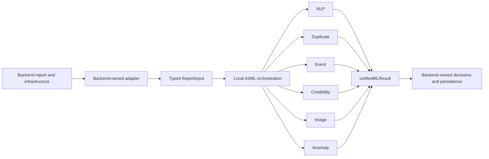

# INDRA AI/ML architecture — current implementation

Status: 25 September 2026. This describes the tested repository code, not an approved production deployment. Phase 26 connects all six frozen **synthetic-development** components to the backend as advisory evidence. None has field validation or permission to make an automatic truth or confirmation decision.

The tested code path is `app.main` → `services.pipeline` → backend-owned `services.ml_adapter` → pure `app.ml.inference.frozen_engine` → `UnifiedMLResult`. The adapter stores the result at `raw_reports.analysis.ml` even when no event is created. Multi-report event candidates are recorded separately at `verified_events.verification_receipt.ml_event_grouping`; the existing backend fusion score and human-review lifecycle remain authoritative. PostgreSQL/PostGIS, Kafka, Redis, HTTP, auth, and any media retrieval remain outside `backend/app/ml/`. The inference path does not load hosted or pretrained models or require network access.

| Component | Current frozen implementation | Live backend status |
| --- | --- | --- |
| NLP | Phase 18 local character/word TF-IDF classifier, five labels | Frozen v3 artifact loaded through the typed result |
| Duplicate | Phase 19 local feature-state matcher | Existing `DedupService` suppression plus typed advisory result; backend spatial/time gates retained |
| Event | Phase 20 deterministic, heuristic complete-link grouping | Frozen configuration used for single-report candidates and advisory multi-report grouping; never self-confirms |
| Credibility | Phase 21 local logistic-regression misleading-risk model | Synthetic-development risk evidence only; separate from the backend's source-prior/fusion decision |
| Image | Phase 22 `scratch-cnn-v2-dual-pool` | Inference only for already-loaded caller-supplied bytes; a stored media URL is never fetched and otherwise yields `NOT_RUN` |
| Anomaly | Phase 23 statistical baseline + `LOCAL_SCRATCH_DUAL_LOGISTIC` | Uses one nearby station's 24 prior stored readings when available; otherwise `NOT_RUN`; synthetic score is not field probability |

The default `InferenceEngine` remains the original component-interface composition. Phase 26's opt-in frozen factory authorizes each artifact separately, preserves an error if one fails to load or infer, and supplies only actual stored values. The backend neither fabricates images/history nor treats missing inference as zero. The station lookup is local, causal, and limited to one station within 25 km. See [inference contract](ML_INFERENCE_CONTRACT.md).

For SIH requirements, the subsystem has development implementations for report classification, duplicate matching, event grouping, misleading-risk assessment, image analysis, and anomaly detection. Its frozen NLP taxonomy is narrower than the broader weather examples (rainfall, thunderstorm, heatwave, fog, dust storm, strong wind): unsupported categories must not be claimed as trained classes. See [model card](ML_MODEL_CARD.md), [validation](ML_VALIDATION_REPORT.md), and [limitations](ML_LIMITATIONS.md).
